# FocusPanel

> 0.11.59 把“显示隐藏图标”这条错误依赖彻底收口为 Panel 自有的“应用与窗口总览”：入口只展示统一应用栏、后台宿主和可管理窗口，不调用 Windows 任务栏抽屉。桌面收纳的完整刷新现在会继续读取每个项目持久化的自定义 `.ico`，不再恢复成系统默认图标；图标模式也改为使用收纳盒与滚动视口的真实宽度计算列数，以固定 12px 节奏居中排列，避免错误单列和不规则空洞。

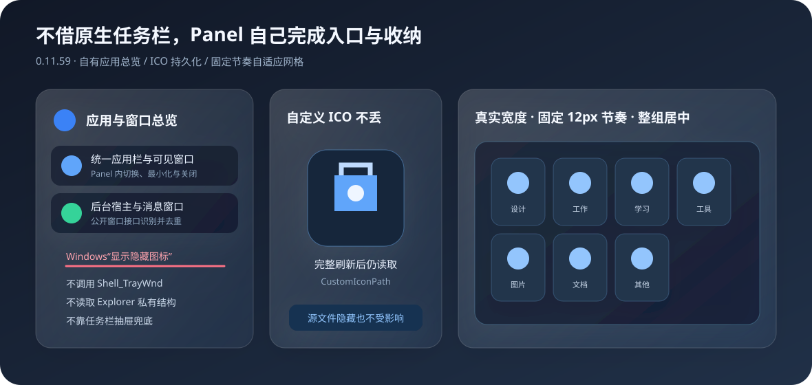

> 0.11.58 让另一类托盘式后台应用进入统一应用栏：如果应用没有普通顶层窗口、只保留 Windows 消息窗口，Panel 现在会通过微软公开的 [`FindWindowEx(HWND_MESSAGE, …)`](https://learn.microsoft.com/windows/win32/api/winuser/nf-winuser-findwindowexw) 找到宿主，并沿用现有应用身份、图标、固定和点击打开语义。消息窗口、隐藏宿主与可见窗口按 AUMID/可执行路径合并，同一浏览器或多进程程序不会重复堆图标；实现不轮询全部进程、不读取 Explorer。没有统一公开协议的第三方托盘菜单仍不会被复制，但“应用入口完全消失”的范围进一步缩小。


> 0.11.57 补上原生任务栏隐藏后非常关键的“应用请求注意”反馈：聊天消息、安装确认或后台操作触发 Windows 系统警报时，Panel 中对应应用出现单层琥珀色 `!`，完整窗口总览也标出具体窗口；图标滚出可视区域时会自动露出一次，但不打乱固定顺序。状态来自微软公开 [`EVENT_SYSTEM_ALERT`](https://learn.microsoft.com/windows/win32/winauto/event-constants) 与 [`SetWinEventHook`](https://learn.microsoft.com/windows/win32/api/winuser/nf-winuser-setwineventhook)，复用现有事件快照，不轮询、不读取 Explorer。应用真正切到前台、窗口关闭或跟踪停止后徽标立即清除，不会留下永久假提醒。


> 0.11.56 让“只有后台宿主、暂时没有可见窗口”的用户应用也进入 Panel 中部统一任务栏：识别沿用现有窗口事件快照，不轮询全部进程，也不打开 Windows 的“显示隐藏图标”。同一应用按 AppUserModelID/可执行路径合并，只显示一个带状态圆点的图标；左键会通过可靠启动目标请求它重新显示界面，右键仍可固定和排序。系统进程、跨会话进程、崩溃辅助程序和 FocusPanel 自身会被过滤。由于第三方托盘菜单没有统一公开协议，本项目仍不会用 Explorer 注入假装复制菜单。

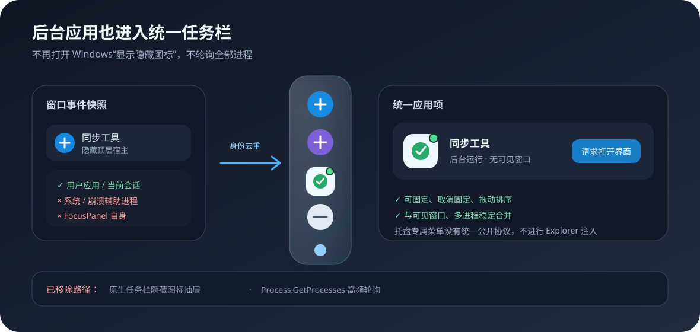

> 0.11.55 把 FocusPanel 自己也从 Windows 通知区撤出：程序不再创建任务栏托盘图标，普通关闭只折回 76px 紧凑栏并保留右缘与全局快捷键，因此不用再从底部“显示隐藏图标”寻找 Panel。状态中心的“后台应用与窗口 · Panel”只进入 Panel 自有总览，不触发原生溢出抽屉；Windows 没有公开接口允许第三方安全搬走其他应用的托盘图标及菜单，本项目不会用 Explorer 注入冒充完整接管。桌面收纳同时修复真实宽度被首次单卡片测量锁死的问题，改为固定 12px 图标节奏；用户选择的 `.ico` 会复制进 `%APPDATA%\FocusPanel\Icons` 并按完整路径/文件标识绑定，同名桌面项不会串图标。显示桌面也改用公开 `Shell.Application.ToggleDesktop`，不再模拟 `Win+D`。


> 0.11.54 把通知管理的最后一段系统壳依赖收回 Panel：通知详情不再提供 Win+N 兼容按钮，开始右键和统一搜索也删除只会发送 Win+W 的“小组件”；对应服务接口、Shell 枚举与虚拟键映射一并移除，不是单纯隐藏界面。Panel 通知新增只看未读、逐条已读、逐条删除和总数摘要，打开详情不会擅自把全部消息标为已读；最多 50 条历史放入 360px 有界虚拟化列表，不再把状态中心越撑越长。

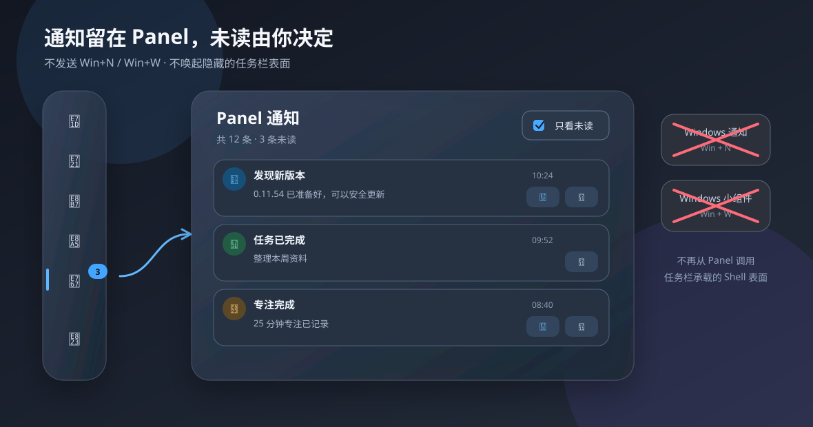

> 0.11.53 把 Panel 通知真正带回 76px 紧凑栏：状态入口右上角显示最多 `99+` 的未读徽标，工具提示与读屏名称同步包含准确数量，不打开状态中心也能知道有消息。`Shift+点击 / Shift+Enter` 可一步打开 Panel 通知详情；再次执行只收起通知区块，状态中心继续保持打开，不会把整个 Panel 一并收回。普通点击、滚轮音量、中键播放/暂停和右键状态菜单保持原语义，六个固定入口数量不增加。

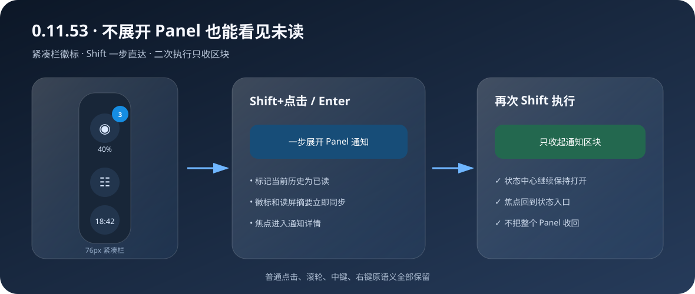

> 0.11.52 让跨重启通知从“只能读”继续变成可操作入口：更新通知重新打开设置页的更新卡，任务收集/完成通知进入任务区，专注完成通知进入番茄钟，失败的桌面恢复通知进入桌面收纳。持久化文件只保存 `None / OpenUpdates / OpenPomodoro / OpenTasks / OpenDesktopOrganizer` 五种白名单语义，不保存路径、参数、命令行或委托；启动后由主壳重新绑定到现有 Panel 导航。旧版快照、未知枚举和解析失败仍保持不可执行并显示过期说明，不会因修改 JSON 获得任意代码执行能力。

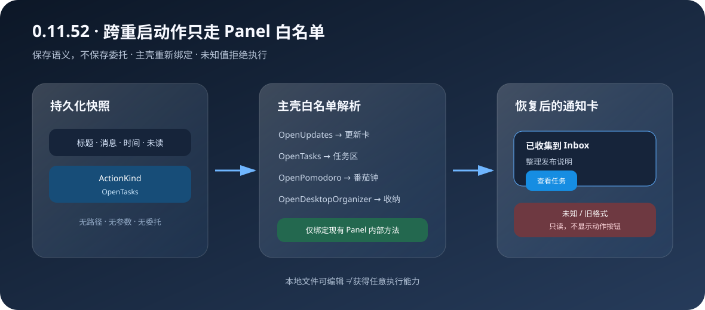

> 0.11.51 让 Panel 通知成为跨重启的真实历史：最多 50 条消息原子保存到 `%LOCALAPPDATA%\FocusPanel\panel-notifications.json`，不进入任务、收纳等业务数据库；连续变化只保留最新待写快照，正常退出、更新重启时会等待写入排空。损坏或超过 1 MB 的历史文件会带时间戳归档后安全从空列表继续，界面明确显示读写警告。重启前的消息仍可阅读和管理，但旧进程里的动作回调不会反序列化，卡片会直说“上次运行的操作已失效”，避免把过期按钮伪装成可执行。

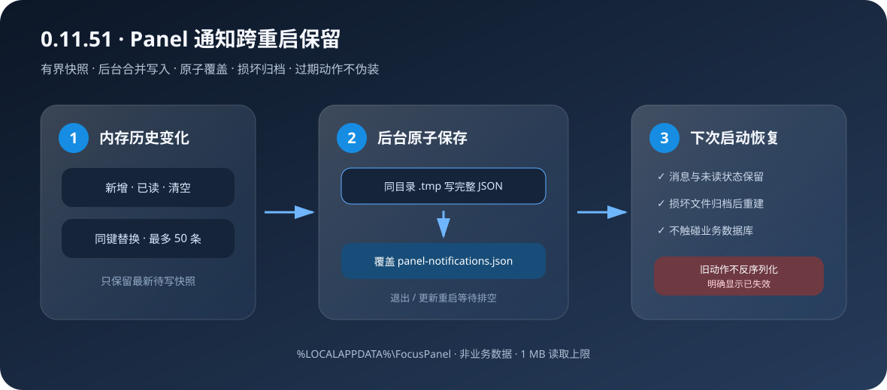

> 0.11.50 把 FocusPanel 自己的通知从一次性浮窗变成状态中心里的可回看历史：更新可用、任务捕获/完成、番茄钟结束、桌面与任务栏恢复消息都会同时进入“Panel 通知”，显示未读徽标，支持全部已读、清空以及重新执行通知原动作；同一事件按身份更新，不会重复刷屏。当时保留的 Win+N 兼容入口已在 0.11.54 完整删除。

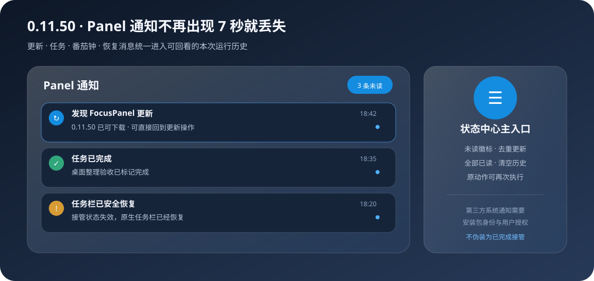

> 0.11.49 修复任务栏接管的结构性假成功：只有公开 [`SetWindowRgn`](https://learn.microsoft.com/en-us/windows/win32/api/winuser/nf-winuser-setwindowrgn) 空区域或 [`DWMWA_CLOAK`](https://learn.microsoft.com/en-us/windows/win32/api/dwmapi/ne-dwmapi-dwmwindowattribute) 至少一层写入并回读确认有效，Panel 才会进入替代状态，不再只靠一次 `SW_HIDE` 等待底边悬停把任务栏重新推出来。Explorer 首次重建宿主或持久抑制层同时丢失时，本次会话允许一次受控修复；再次发生就立即恢复系统任务栏，不会形成过去那种隐藏/出现循环。

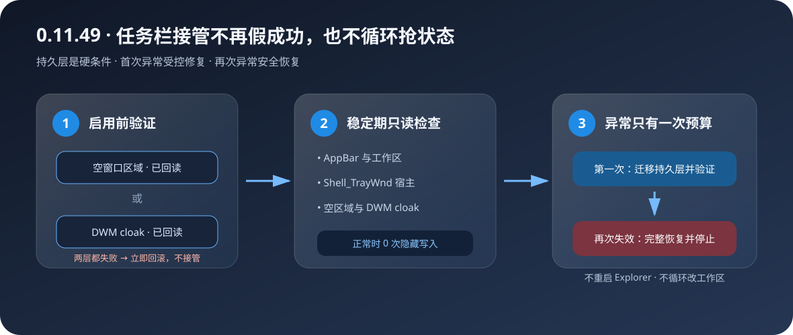

> 0.11.48 聚焦修复三处直接影响使用的问题：状态中心的入口明确收口为“Panel 应用与窗口”，只进入 Panel 自己的窗口总览，不触发原生任务栏隐藏图标区；用户选择的独立 `.ico` 现在由应用直接解码并选择最合适的尺寸，不再依赖不同机器表现不一致的 Shell 抽取；收纳图标视图会在真实宽度出现后强制重排，并把每一行宽度均匀分给固定尺寸图标卡，避免启动时锁成单列或左右留出怪异大洞。


> 0.11.47 让网络管理超出原生任务栏的“附近列表”：Panel 现在通过微软公开的 [`WlanGetProfileList`](https://learn.microsoft.com/windows/win32/api/wlanapi/nf-wlanapi-wlangetprofilelist) 枚举每张无线网卡的全部已保存配置，即使某个网络当前不在附近也会在列表末尾显示“离线 / 已保存·当前不在附近”，可直接忘记。附近网络仍独立保留最多 10 项，离线配置另保留最多 6 项，不会互相挤占；同名配置按网卡隔离，组策略下发的配置明确显示“组织管理”并禁用删除。

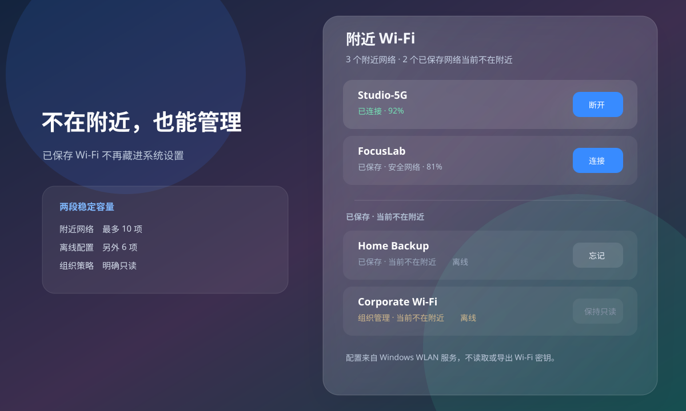

> 0.11.46 让 Wi‑Fi 管理形成完整闭环：当前网络不再是不可点击的“当前”，可直接从 Panel 断开；每个已保存网络都提供明确的“忘记”动作。忘记当前网络会先二次确认，再按“断开 → 确认断开 → 删除 Windows 配置 → 确认配置消失”的顺序执行。全部操作使用微软公开的 [`WlanDisconnect`](https://learn.microsoft.com/windows/win32/api/wlanapi/nf-wlanapi-wlandisconnect) 与 [`WlanDeleteProfile`](https://learn.microsoft.com/windows/win32/api/wlanapi/nf-wlanapi-wlandeleteprofile)，权限拒绝、无线服务异常和状态未确认不会显示成成功。

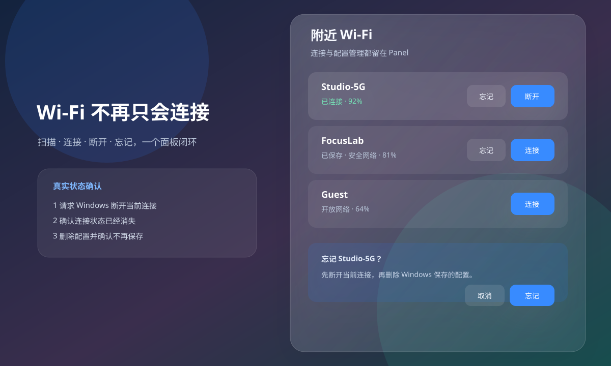

> 0.11.45 把蓝牙设备管理收进 Panel：“网络与无线”现在可以直接发现已配对和附近设备，准确区分已连接、已配对、在附近与可配对状态，并在当前侧栏完成配对或移除。Classic 与低功耗端点按 Windows 设备身份去重，已连接和已配对设备优先，不会重复堆出同一副耳机。首次配对仍会由 Windows 显示一次安全确认，这是桌面应用不能绕过的系统安全边界，但不会打开任务栏蓝牙浮层。

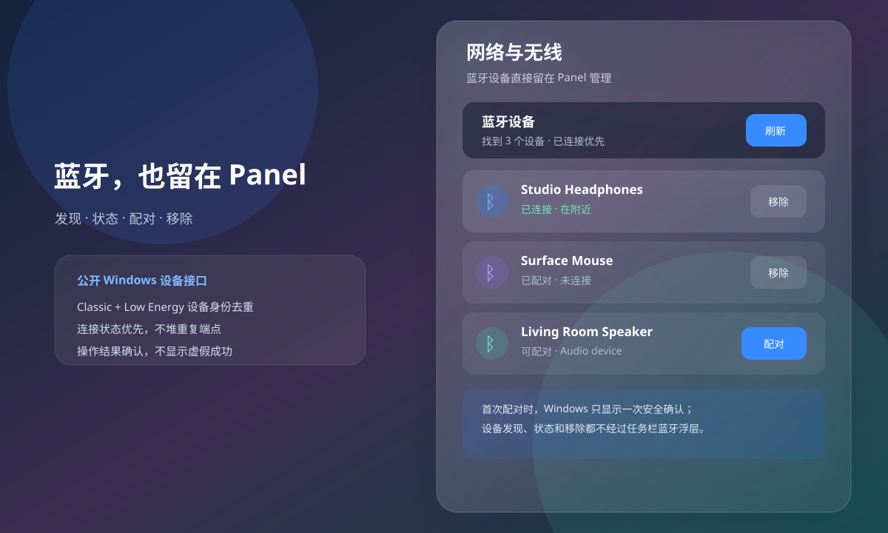

> 0.11.44 补齐 Panel 原生网络面板最明显的断点：附近 Wi‑Fi 第一次连接时可直接在 Panel 输入密码，不再离开侧栏去 Windows 网络设置。开放网络可直接连接，WPA/WPA2/WPA3 Personal 使用 Windows 公开的 WLAN 配置接口；密码不进入 FocusPanel 数据库、配置或日志，提交后的临时内存立即清零，由 Windows 在系统网络配置库中加密保存。密码错误或网络超时会清理本次失败配置，下一次仍可直接重新输入；企业网络明确标注组织登录边界，不用普通密码框误导用户。

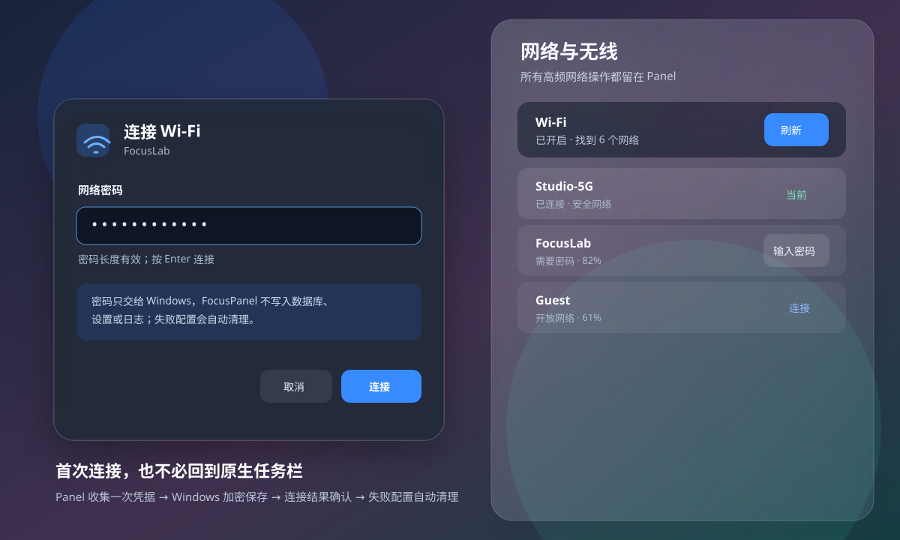

> 0.11.43 继续把高频状态操作收回 Panel：统一搜索中的“快捷设置 / Win+A”现在直接打开“网络与无线”，“键盘 / Win+Space”直接打开输入法详情，“音量混合器”和“电池”也进入对应 Panel 详情；状态按钮右键提供相同的 Panel 原生入口，不再发送 Win+A、Win+Space 或已移除的 Win+Tab。当时保留的 Windows 通知中心入口已在 0.11.54 删除。收纳图标布局新增完整 WPF 运行时验收，720px 工作区实测使用 6 列和 664px 可用宽度，防止再次退化成一行一个。

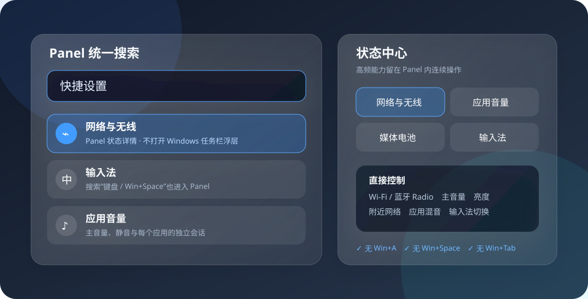

> 0.11.42 把最后一个伪“运行”入口从 Windows `Win+R` 收回 Panel：在统一搜索输入 `>` 后直接键入程序、文档、网址或带参数命令，支持带空格路径的引号和环境变量，不经过 `cmd.exe`，开始右键的“Panel 运行…”也进入同一界面。同时继续修正桌面收纳：右键任意收纳卡片可选择自己的 `.ico` 并永久保存，已有快捷方式图标会在隐藏前固化；图标视图强制使用完整可用宽度测量，不再偶发缩成一列。状态中心只进入 Panel 自有“后台应用与窗口”，不存在弹出原生任务栏隐藏图标区的入口。

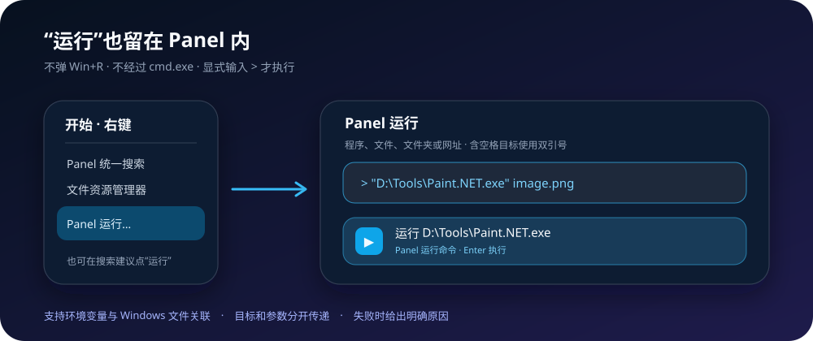


> 0.11.41 让应用管理进一步脱离原生任务栏：紧凑应用栏右键可以直接“打开程序位置”或“打开快捷方式位置”；Panel 自有“开始”和统一搜索里的应用结果也获得相同的右键菜单，可启动、管理员启动、定位文件和固定。运行应用只使用窗口追踪器已经确认的真实 EXE，未运行快捷方式定位自身 `.lnk`；商店应用没有本地路径时不按名称猜测，也不会误开无关文件夹。

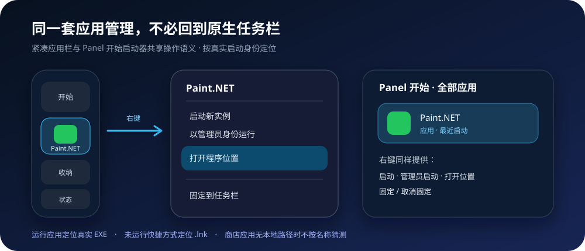

> 0.11.40 继续移除“替代外观、实际回到 Windows”的残留：开始入口不再用 `Shift+点击` 唤起 Windows 开始菜单，改为打开 Panel 自己的统一搜索；右键菜单也删除重复的 Windows 搜索项，只保留 Panel 搜索与直接系统管理命令，状态服务和快捷键映射中的开始/搜索调用已删除。焦点位于 76px 紧凑栏任意按钮时可以直接输入中文或英文，Panel 会自动展开统一搜索并保留第一个输入，不必先寻找搜索按钮；文本编辑、下拉选择、菜单展开和 Ctrl/Alt/Windows 命令组合不会被抢走，Shift 大写输入仍然可用。

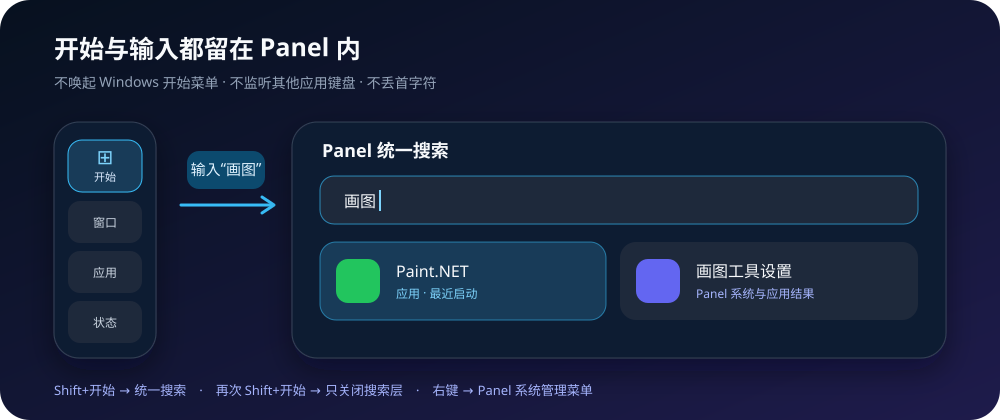

> 0.11.39 让 Panel 自有“开始”从完整目录进一步变成高频启动器：固定应用始终在最前，其后按最近成功启动顺序排列，并用“最近启动”明确标识；历史最多保留 8 项，跨重启保存。同名应用只按 AUMID 或规范化可执行路径身份匹配，失败启动不写历史；输入搜索词后仍使用原有相关性排序。项目同时移除不再使用的 UI Automation 程序集引用，当前启动器和后台窗口总览不通过原生任务栏或通知区按钮工作。


> 0.11.38 让统一应用栏真正能连续用键盘：聚焦任意应用图标后，`↑ / ↓` 浏览相邻项，`Home / End` 到首尾，`PageUp / PageDown` 按当前可见数量翻页；选中项会自动避开上下悬浮箭头并滚进可视区。固定应用原有的 `Alt+↑ / Alt+↓` 排序、Enter 启动或切换、Shift+F10 右键菜单都保持原语义，滚动箭头也不再插进 Tab 顺序。

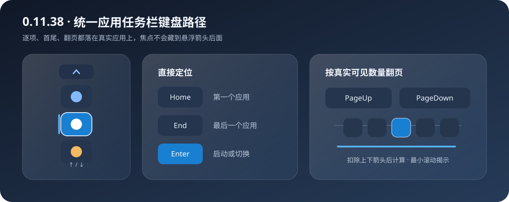

> 0.11.37 把三处真实回归一起修正：状态中心不再提供任何会从原生任务栏弹出的“显示隐藏图标”入口，只保留 Panel 自己的后台与窗口总览；收纳后的 `.lnk` 会直接读取快捷方式指定的 `.ico`，网址快捷方式和自定义文件夹图标也一并支持；图标视图先按真实可用宽度计算列数，使用固定桌面式间距并整体居中，不会再偶发锁成一列或把图标拉得忽远忽近。


> 0.11.36 解决多窗口应用把右键菜单撑满屏幕的问题：应用快选和实时预览失败后的文字列表最多显示 4 个窗口，当前活动窗口在需要截断时保证排在首位。其余窗口不会消失，菜单会给出“查看全部 N 个窗口…”并一步进入完整窗口总览，避免为了功能完整再次堆出没有设计层级的超长菜单。

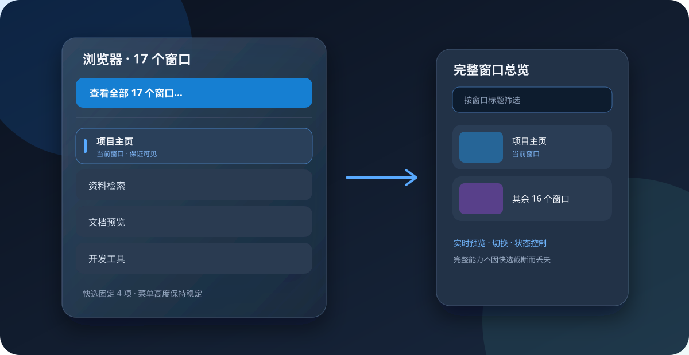

> 0.11.35 为多窗口应用增加应用级状态控制：右键浏览器、资源管理器或编辑器图标，可以一步“最小化全部窗口”，之后再“还原已最小化窗口”。操作只改变确实需要变化的窗口，保留未最小化窗口原有状态；关闭全部也改用相同的隔离执行机制，一个窗口拒绝不会拖住其余窗口。


> 0.11.34 把实时缩略图从“只能看”升级为可直接操作的窗口卡：每个画面下方都有最小化、最大化/还原和关闭按钮，按钮会跟随窗口真实状态变化。选择好目标画面后即可原地处理，不必再退出预览、右键应用并钻进逐窗口菜单。


> 0.11.33 补齐了虚拟桌面上的任务栏连续性：切到另一个 Windows 桌面后，Panel 不再留在旧桌面。常驻紧凑栏会自动跟随；非常驻模式下，右缘、全局快捷键或托盘唤出会先把 Panel 移到当前桌面。窗口总览顶部同时新增“上一个 / 新建 / 下一个 / 关闭”四个直接入口，不必再依赖失效的任务视图按钮或藏在开始右键菜单里。实现只使用微软公开的 [`IVirtualDesktopManager`](https://learn.microsoft.com/en-us/windows/win32/api/shobjidl_core/nn-shobjidl_core-ivirtualdesktopmanager)、[`GetWindowDesktopId`](https://learn.microsoft.com/en-us/windows/win32/api/shobjidl_core/nf-shobjidl_core-ivirtualdesktopmanager-getwindowdesktopid) 和 [`MoveWindowToDesktop`](https://learn.microsoft.com/en-us/windows/win32/api/shobjidl_core/nf-shobjidl_core-ivirtualdesktopmanager-movewindowtodesktop)，不接入版本易变的 Shell 私有接口。

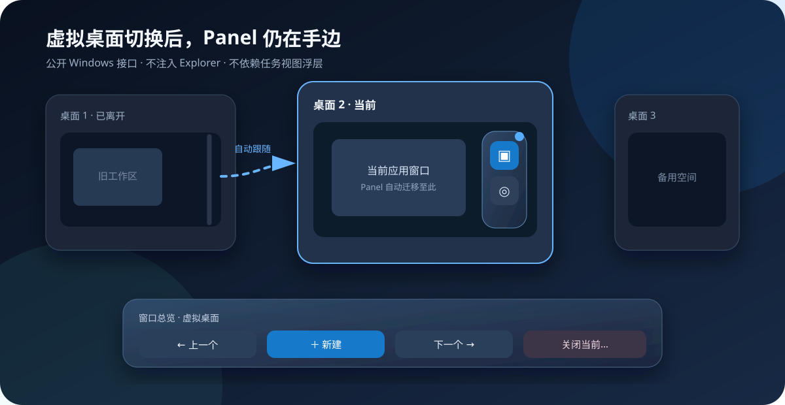

> 0.11.32 把“开始”变成 Panel 自己的完整应用启动器：普通点击直接浏览全部应用，固定项优先，可搜索、启动和固定；再点一次只关闭应用目录。当时保留的 `Shift+点击` Windows 开始菜单兼容入口已在 0.11.40 改为 Panel 统一搜索。紧凑栏“窗口”现在显示实时数量，窗口总览每一行都有明确的缩略图按钮，点击即可查看 DWM 实时画面并切换或关闭，不必回到底部原生任务栏找窗口缩略项。

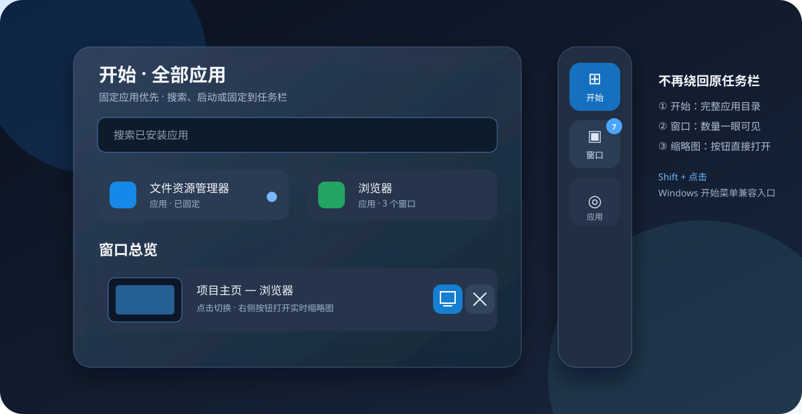

> 0.11.31 把输入法从 Windows 辅助浮层提升为 Panel 原生能力：状态中心直接列出已安装输入法，显示当前项并把选择应用到刚才使用的窗口；同一种语言的拼音、五笔或不同键盘布局不会被错误合并。请求投递后还会读取目标线程的实际布局进行确认，不能确认时明确说明，Win+Space 只保留为详情底部的兼容回退。

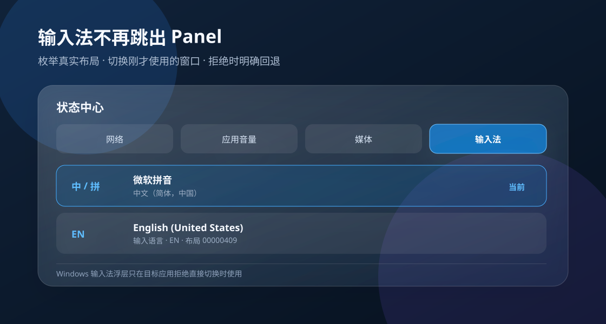

> 0.11.30 把状态中心从“先跳 Windows 浮层”改成“Panel 自己先完成操作”：网络与无线、应用音量、媒体与电池成为首屏三个主入口，点击后在当前面板内互斥展开，再点一次关闭。快捷设置、通知中心和输入法仍可用，但被清楚标成 Windows 辅助入口。打开状态中心后的键盘焦点也直接落到 Panel 自有的后台与窗口管理。

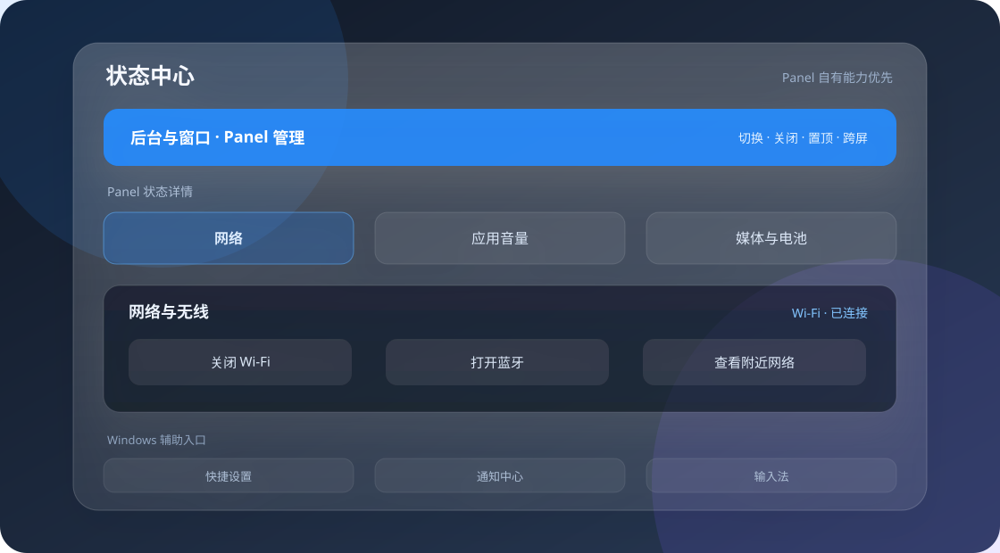

> 0.11.29 修复了 0.11.28 全宽图标视图在部分机器上不出现的问题：反向布尔绑定现在会按 WPF 目标属性返回真正的 `Visible/Collapsed`，不会再把布尔值错误塞给可见性属性。该版本曾通过统一输入边界唤起 Windows 开始菜单；0.11.40 已删除这条兼容链，右键系统管理菜单保持不变。

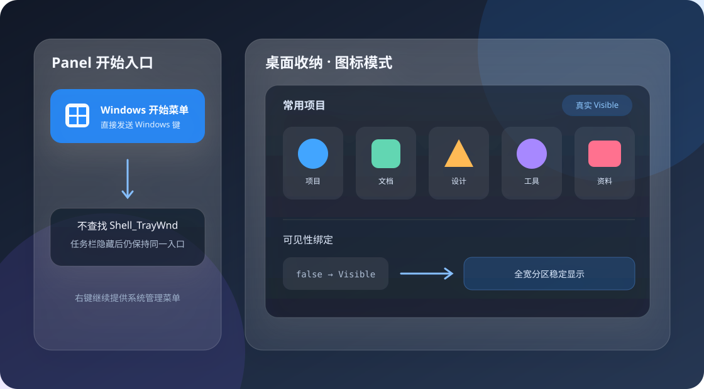

> 0.11.28 撤掉了会从原生任务栏弹出“隐藏图标”的伪入口，状态中心现在直接进入 Panel 自己的后台与窗口总览；Windows 未提供安全的第三方托盘图标枚举接口，因此不会再为了看起来“能用”而偷偷呼出原任务栏。桌面快捷方式收纳后继续使用其自定义 `.ico`，图标模式下每个收纳分区也改为全宽自适应网格，不再因双列卡片过窄出现大块空隙或整行只有一个图标。

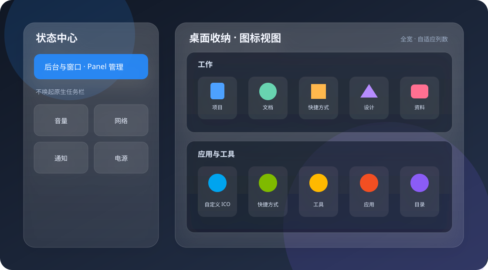

> 0.11.27 将多窗口应用的普通左键从小型文字菜单升级为完整窗口总览。点击应用图标后会按 Windows 应用身份精确筛选，只显示该应用的所有窗口，并直接复用实时缩略图、切换、关闭、最小化、最大化、置顶和跨屏移动；同名但身份不同的程序不会误混。顶部筛选条明确显示当前应用，并可一键“查看全部”。旧文字列表仅保留为 DWM 预览不可用时的悬停降级。

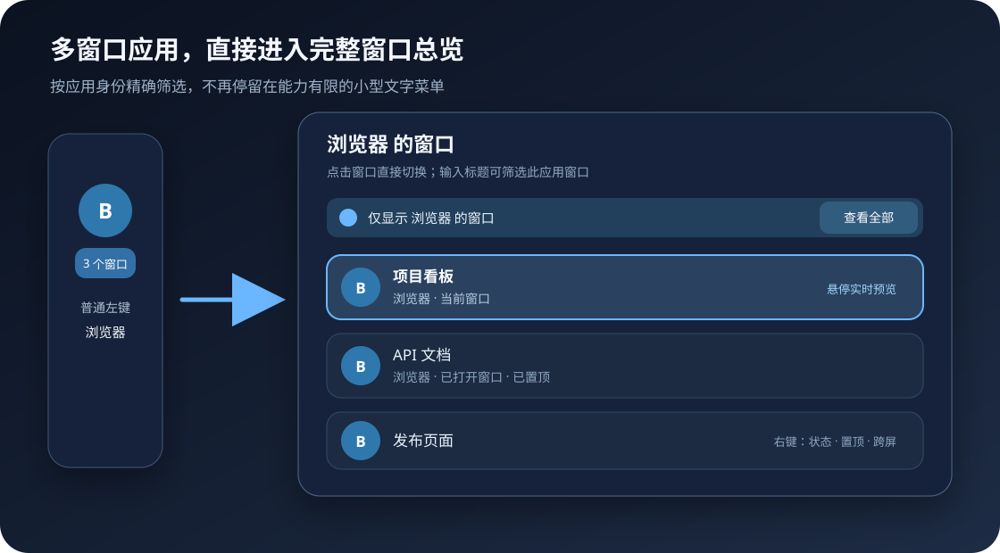

> 0.11.26 为浏览器、资源管理器、编辑器等多窗口应用增加应用级批量跨屏操作。右键统一任务栏应用图标后，只要该应用至少有一个窗口位于其他显示器，就会出现“把此应用的窗口移到 Panel 屏幕”；已经在目标屏幕的窗口自动跳过，其余窗口复用同一套安全移动边界逐个处理，单个失败不会中断整批操作，状态中心会给出成功与失败数量。

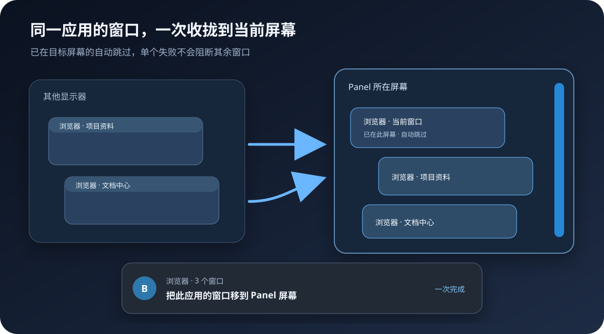

> 0.11.25 为窗口总览增加无需切回应用的“置顶窗口 / 取消置顶窗口”。窗口真实置顶状态会显示在列表副标题与读屏名称中，右键菜单使用勾选项明确反馈当前状态；操作不移动、不缩放、不激活窗口，并通过异步 Win32 请求避免无响应应用阻塞 Panel。置顶状态仍由目标应用和 Windows 管理，不写入 FocusPanel 数据库。


> 0.11.24 为多屏窗口管理增加“移到 Panel 所在屏幕”：在窗口总览行或应用窗口菜单中右键，只有当窗口位于其他显示器时才会出现该动作。移动会沿用设置页选定的 Panel 显示器，保持窗口原有大小和相对位置，超出较小屏幕时自动收进目标工作区；最大化、最小化状态和前台焦点均保持不变。

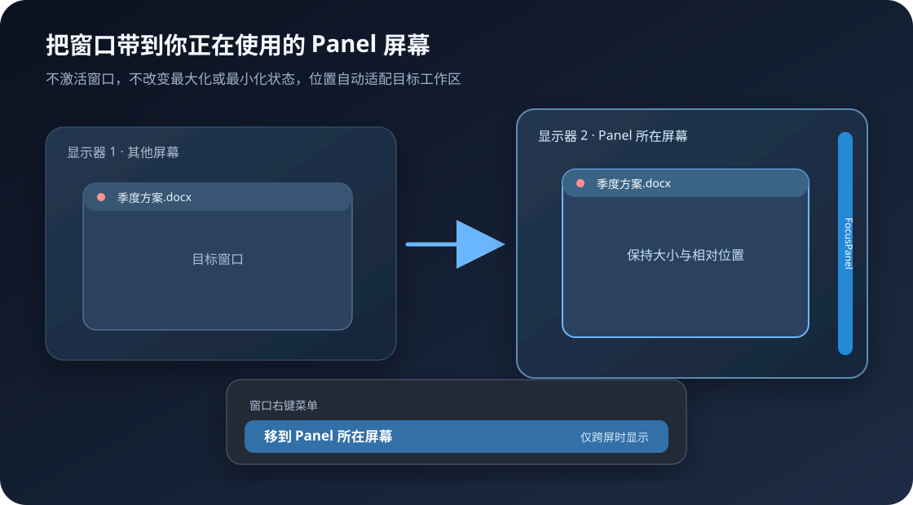

> 0.11.23 给窗口总览补齐单层右键操作：直接右键任意窗口行，即可切换、最小化、最大化、还原或正常关闭。菜单只显示当前窗口状态下有效的动作；打开菜单时 Panel 会保持展开，切换后自动关闭总览，不再需要回到底部原生任务栏管理窗口。

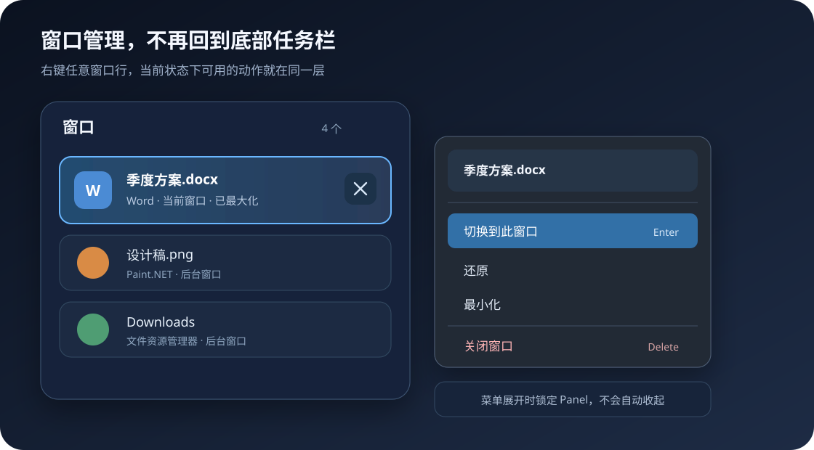

> 0.11.22 为一级窗口总览补上真正的 DWM 实时缩略图：鼠标停留在任意窗口行约 420ms 即可看到该窗口当前画面，点击画面直接切换；DWM 不可用时继续使用文字列表，不会留下空壳。键盘用户可把焦点移入列表后按 `Delete` 正常关闭当前窗口。

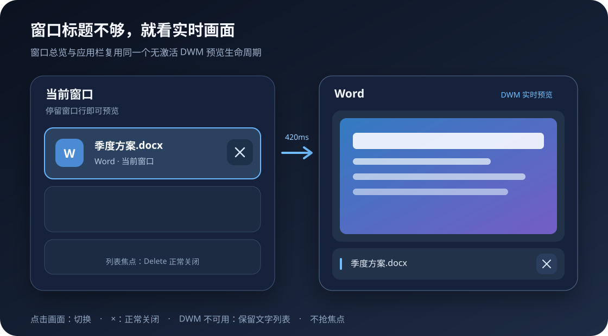

> 0.11.21 把窗口总览从搜索弹层第二层提到紧凑栏一级入口：原“搜索”按钮现在明确标为“窗口”，普通点击直接看到全部窗口；点击整行切换，点击右侧关闭按钮发送正常关闭请求。全局快捷键仍打开完整统一搜索，因此窗口管理和键盘搜索不再争用同一种默认状态。

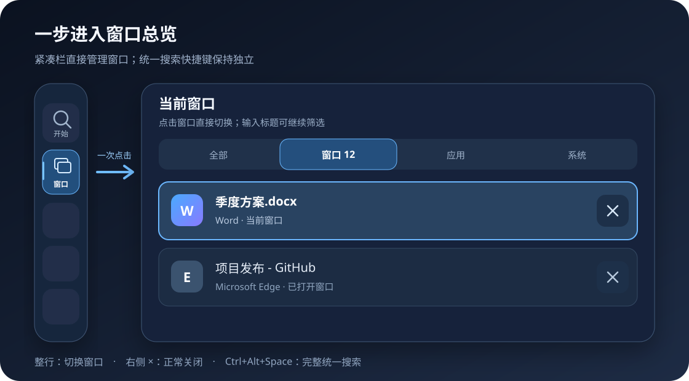

> 0.11.20 给所有已打开窗口增加了一个真正看得见的总入口。打开统一搜索后，顶部直接显示“全部 / 窗口数量 / 应用 / 系统”；点击“窗口”无需输入即可浏览当前所有窗口，活动窗口置顶，点击一行直接切换。它复用 Panel 已有的 WinEvent 窗口快照，不会为了显示窗口重新展开原生任务栏。

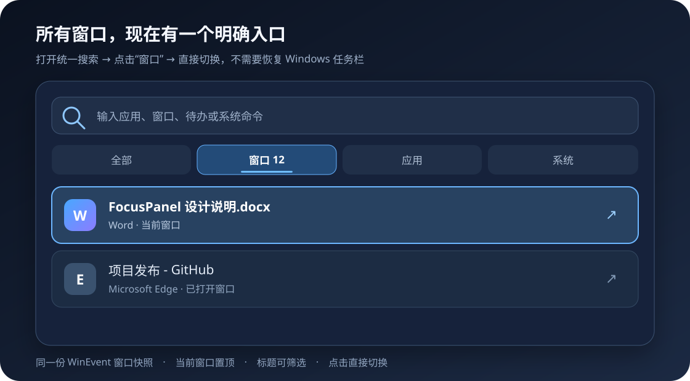

> 0.11.17 修复 AI 助手把“继续把应用程序图标分下区”误当成普通聊天的问题。“分下区、分类、归类、继续整理”等自然说法只要明确指向桌面图标、文件或收纳项目，就会直接进入受控分区 Agent，读取现有未锁定收纳布局并生成待确认预览，不再要求用户重复提供截图或图标清单；硬盘分区等无关语义不会误触。

> 0.11.16 修复“底部悬停重新呼出 Windows 任务栏，同时 FocusPanel 显示已安全恢复”：任务栏原本启用自动隐藏时，遗留恢复会话现在可以正确完成并清理；接管守护按空区域、DWM cloak 与窗口隐藏的整体结果判断，不再因单层瞬时失效就退出。只有所有抑制层都失效且原生任务栏实际重新出现时才安全恢复，过程中不循环隐藏、不反复写工作区。

> 0.11.15 将智能分区从“按文件名猜测”升级为上下文规划：模型会看到项目当前所在的未锁定收纳盒，从整组布局推断你的分类习惯；聊天中输入的整理要求会进入本次计划。每条建议显示置信度与理由，低于 68% 的不确定项目保持原位，确认前仍不会修改任何分类数据。


> 0.11.14 将智能分区从隐蔽的配置开关升级为桌面收纳工具栏上的明确主按钮。AI 可以重新规划已经分好区、但所在收纳盒未锁定的项目；每个收纳盒都能持久化锁定，锁定来源和目标均不参与 AI。所有调整先显示逐项预览，确认后才在一个 SQLite 事务中更新分类，不移动、不改名、不重新隐藏文件。AI 聊天新增同一 Agent 动作接口，输入“帮我智能分区”或“重新整理收纳盒”会生成待确认计划，聊天不能绕过确认直接修改数据。


> 0.11.13 为 AI 助手默认提供 DeepSeek 接入，同时保留旧 OpenAI 配置并严格隔离两套 API Key。桌面收纳保留“本地按类型”和“DeepSeek 智能分区”两种方式：用户手动分区始终优先；AI 只接收文件名、扩展名和项目类型，不接收完整路径或文件内容，未配置、关闭、离线或返回无效结果时自动回退本地分区，不阻断文件属性事务。


> 0.11.12 根据用户提供的真实崩溃日志修复“已收纳图标切换分区后闪退”：自定义虚拟化面板现在会在集合删除、替换、移动和重置时同步移除失效容器；若 WPF 的 `ItemContainerGenerator` 已先行丢弃槽位，面板不会再对旧 `GeneratorPosition` 二次调用 `Remove/Recycle`。新增真实 STA/WPF 双分区压力测试，原版可稳定复现相同空引用，修复后反复双向移动及清空分区均通过。


> 0.11.11 修复桌面收纳状态链：程序异常退出或遗留恢复标记只会回滚“收纳中/恢复中”的未完成事务，已经稳定收纳的项目不会再自行出现在桌面；旧版误收纳的 FocusPanel 启动器只逐项恢复，不再连带恢复整批图标。自动整理会沿用项目已有的自定义分区，只有未分类项目才按文件类型分区。当前属性模式不会移动或改名真实文件，旧 `.FocusPanel` 仓库仍仅在用户明确取消旧版收纳时搬回桌面。


FocusPanel 是面向 Windows 11 的右侧玻璃任务栏与桌面效率工作区。它提供桌面收纳、任务、番茄钟、AI、应用启动、运行窗口管理、系统状态与日期时间入口。旧版 OKR 表只为升级兼容保留，不再出现在产品界面，也不会被概览或 AI 读取。

> 0.11.10 补齐窗口状态的实时刷新：外部应用自行最小化、还原、最大化或恢复大小时，Windows 的 `EVENT_SYSTEM_MINIMIZESTART/END` 与顶层 `EVENT_OBJECT_LOCATIONCHANGE` 会进入现有 140ms 防抖和合并后台快照。应用栏状态不再依赖下一次前台切换才纠正，也不会在拖动或连续调整窗口期间高频枚举。

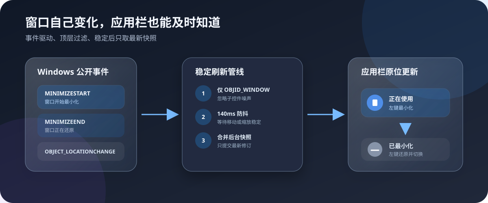

> 0.11.9 不再把所有非活动窗口笼统写成“正在运行”：应用栏会明确区分“正在使用”“后台运行”和“已最小化”，单窗口提示直接说明下一次点击是最小化、切换还是还原。悬停窗口列表同步标出当前、已最小化和已最大化窗口；全部最小化的应用使用更短、更弱的运行指示线，不靠猜测复制 Explorer 私有闪烁状态。


> 0.11.19 曾恢复由 Windows 原生承载的托盘应用抽屉；0.11.28 已删除这条依赖任务栏宿主的入口。现在状态中心使用 Panel 自有后台与窗口总览，第三方仅托盘图标不再伪装成可由 Panel 完整枚举。
>
> 0.11.8 让应用任务栏的溢出滚动真正覆盖整条区域：鼠标位于应用图标、图标间空白或上下导航按钮上都可以直接滚动；`Ctrl+滚轮` 位于多窗口应用上时仍切换该应用窗口。上下导航的点击区由 28px 扩大到 44px，并同步扩大可见内容保护区，不再用难点的小箭头遮住应用。

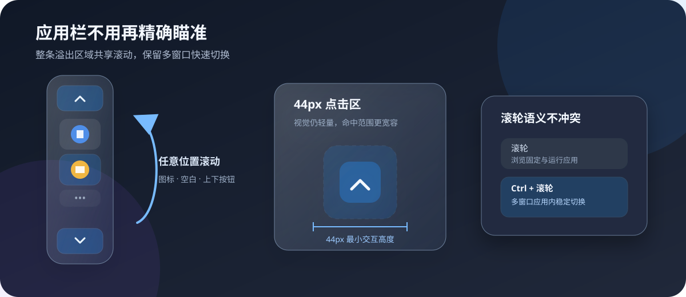

> 0.11.7 修正设置与更新入口的操作上下文：从顶部“设置”打开后，关闭弹层会把键盘焦点还给设置入口，不再莫名跳到“收纳”；点击更新通知的“打开更新”会直接滚到软件更新卡片并聚焦一键更新按钮，不再让用户进入设置后自己寻找。


> 0.11.6 起，“收纳”入口右上角不再显示与它无关的软件更新圆点，而是显示当前真实已收纳项目数；隐藏、恢复、自动整理或外部文件变化后都会随现有文件事件即时更新。软件更新提示迁到展开工作区的“设置”，状态与对应操作终于位于同一入口。

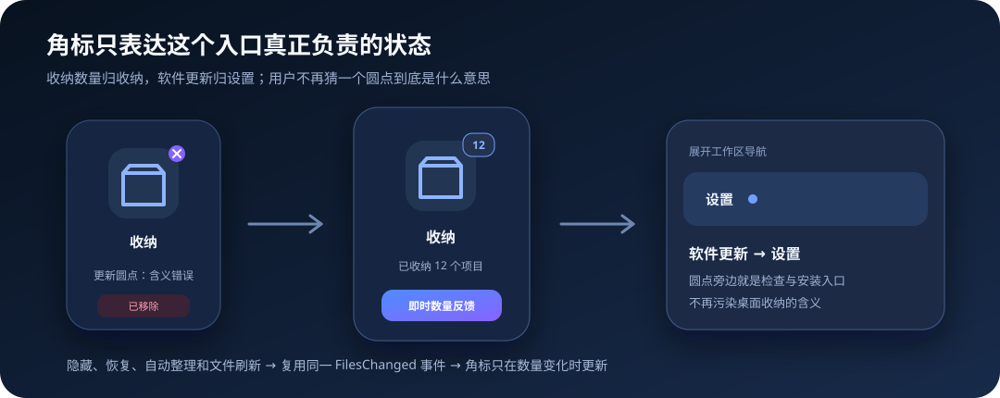

> 0.11.5 起，紧凑栏“任务”入口不再只负责打开页面：左键仍按原习惯直达任务工作区，右键明确提供“快速添加到 Inbox…”。选择后输入界面会自动聚焦并显示专用说明，输入标题按 Enter 即可保存；无需先进入 Inbox，也无需记忆“任务 + 空格”的搜索语法。


> 0.11.4 起，状态入口恢复符合任务栏习惯的右键菜单，不再一次右键就无提示切换静音。菜单以单层 Fluent 表面明确提供静音/取消静音、播放/暂停、快捷设置、通知中心、输入法和电源；左键打开完整状态中心、滚轮调音量和中键播放/暂停保持不变，固定入口数量也没有增加。


> 0.11.3 起，紧凑栏系统状态不再只写含义宽泛的“状态”：音频正常时直接显示 `45%` 一类实时音量，静音显示“静音”，没有默认输出设备则显示“不可用”。鼠标移入时复用已有合并刷新队列读取一次真实系统状态；Panel 隐藏时仍不轮询。0.11.4 将当时的右键直接静音进一步改成了标准快捷菜单。


> 0.11.2 起，展开工作区顶部的概览、桌面收纳、任务、番茄钟、AI 和设置统一为一组单层 Fluent 标签导航。当前模块拥有唯一的强调表面、描边与底部指示线；设置覆盖层打开时只高亮设置，关闭后恢复此前模块，不再出现两个“当前页”或六个按钮毫无区别的情况。


> 0.11.1 起，产品最核心的“桌面收纳”和“任务”不再藏在含义模糊的“工作”按钮后面：两者都是紧凑栏上始终可见的一键入口。任务入口直接显示未完成数量，收纳与任务入口用状态线标记最近打开的主工作区；概览、番茄钟、AI 和设置继续位于展开后的一级导航，不再创建模块中转弹层。


> 0.11.0 曾让“开始”普通点击直接打开 Windows 开始菜单；0.11.32 将普通点击升级为 Panel 原生全部应用启动器，0.11.40 又彻底删除 Windows 开始兼容入口并把 `Shift+点击` 改为 Panel 统一搜索。右键或 `Shift+F10` 仍可打开完整系统管理菜单，虚拟桌面操作也继续位于该菜单。

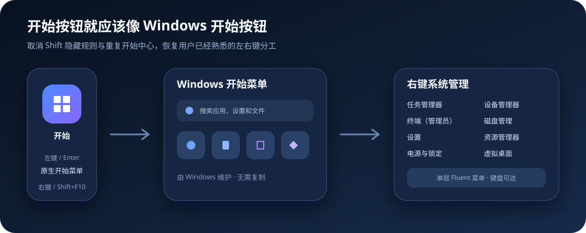

> 0.10.99 起，状态中心首屏只保留任务栏状态、六个常用动作、主音量和亮度。网络与无线、应用音量、媒体与电池收进三个默认折叠的详情区；标题直接显示网络名称或音频会话摘要，需要时再以 44px Fluent 标题展开。功能没有删除，但不再把所有控制同时堆给用户。

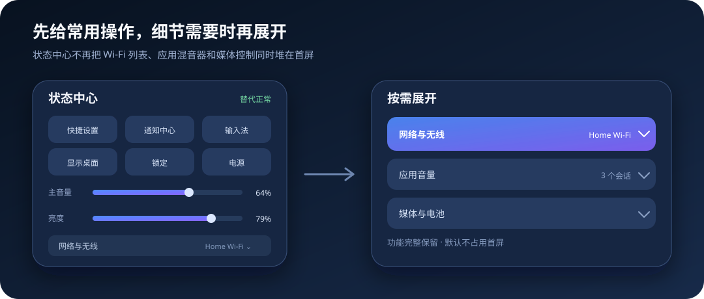

> 0.10.98 曾以“工作”按钮直达最近工作区；0.11.1 已进一步拆为“收纳”和“任务”两个明确入口。展开后，概览、桌面收纳、任务、番茄钟、AI 和设置六个入口仍始终位于标题下方。


> 0.10.97 起，首次启动不再逼用户先隐藏 Windows 任务栏：推荐按钮改为“开始使用（保留任务栏）”，可以先完整体验 Panel，再从设置决定是否接管。引导只出现一次，选择保留任务栏后不会下次启动再次遮住工作区；任务栏异常安全恢复也不会把用户送回首次引导。没有明确保存过常驻偏好的新旧用户默认看见 76px 紧凑栏，明确关闭过的人保持原选择。


> 0.10.96 首次让新安装默认始终显示 76px 紧凑栏；0.10.97 将这项可发现性改进扩展到所有“尚未明确保存开关”的升级用户。明确选择过关闭的人仍保持自动隐藏。启动后即可看到开始、统一搜索、应用任务栏、工作、状态和时间，工作区离开后只折回紧凑栏。


> 0.10.95 起，统一搜索补齐四个不依赖原生任务栏的高频 Windows 入口：输入“截图 / 截屏”“声音输出 / 音量混合器”“投影 / 扩展屏”或“无线显示器 / 投屏”即可回车打开对应系统面板。它们分别复用 Windows 公开的 `Win+Shift+S`、`Win+Ctrl+V`、`Win+P` 与 `Win+K` 语义，不增加紧凑栏按钮，也不会为了省一步而引入依赖当前输入焦点、容易把内容送错窗口的伪快捷操作。

> 0.10.94 起，多窗口应用支持 Windows 任务栏式 `Ctrl+左键` 循环：`Ctrl+左键` 直接切到下一个窗口并在首尾环绕，连续点击沿用刚刚切换的真实窗口，不等待前台快照回写。0.11.27 起普通左键改为打开按应用身份筛选的完整窗口总览；提示文字继续明确为 `Ctrl+滚轮`，不再错误宣称普通滚轮会切窗口。

> 0.10.93 起，“显示桌面”不再只能进入状态中心寻找：紧凑栏时间入口支持 `Shift+左键`、`Shift+Enter` 或鼠标中键一步切换桌面；右键菜单也提供同一动作。0.11.55 起该动作直接调用 Windows Shell 的公开 `ToggleDesktop`，不再模拟 `Win+D`。普通左键仍打开月历与今日任务，不新增第六个固定按钮。

> 0.10.92 曾为紧凑栏 Focus 入口增加 `Shift+左键` 直达；0.10.98 已取消这种需要记忆的差异手势，普通左键和 Enter 都直接打开最近工作区。右键或 `Shift+F10` 继续提供概览、桌面收纳、任务、番茄钟、AI 与设置的单层菜单。

> 0.10.91 起，设置页可启用“鼠标离开后保留 76px 紧凑栏”。展开工作区离开后只折回应用任务栏，不再整条消失；常用应用、开始、搜索、工作、状态和时间保持可见。0.10.97 起缺少明确偏好的新旧安装默认启用，已明确关闭者不变；全屏保护、托盘隐藏与 `Esc` 的明确用户意图仍优先。

> 0.10.90 起，右缘悬停呼出支持“灵敏 0.04 秒、标准 0.1 秒、稳妥 0.18 秒、刻意 0.3 秒”四档。设置修改会在现有后台监测器内立即重置停留状态并生效，不重建透明窗口、不抢焦点；12px 感应带、30ms 物理坐标采样、32px 防抖复位和全屏抑制保持不变。

> 0.10.89 起，设置页可以选择鼠标离开后的自动收起速度：快速 0.3 秒、标准 0.5 秒、从容 0.8 秒或较慢 1.2 秒。选择立即生效并持久化；输入、拖拽、菜单、模态确认和固定展开继续优先阻止误收起，主动唤出宽限与失焦安全收回也不被普通速度设置覆盖。

> 0.10.88 起，76px 紧凑栏入口不再只显示需要猜测的图标，而是在同一个圆角按钮内直接标出短标签；0.11.3 又将状态入口的固定“状态”升级为实时音量、静音或设备不可用值。搜索、状态/电源或日历打开时，对应入口左侧持续显示强调色状态线。

> 0.10.87 起，统一应用栏前九个槽位只有在本次会话真实注册成功快捷键后才显示数字角标。快捷键关闭、原生任务栏已恢复或某个组合被其他程序占用时，对应角标和提示会立即消失；只成功注册“启动/切换”或“新实例”其中一种时，工具提示也只说明实际可用动作，不再作虚假承诺。

> 0.10.86 起，统一搜索空查询时展示“任务管理器、音量 50、专注 25、新建任务”四个可编辑示例，帮助发现搜索不仅能启动应用。点击示例只填入搜索框并把光标放到末尾，绝不自动执行；修改或确认内容后仍需按 Enter。

> 0.10.85 起，状态中心第一屏按“常用动作 → 主音量 → 亮度”排列，调音量和屏幕亮度不再需要越过网络扫描与应用混音器。网络、Wi‑Fi、媒体、电池和应用级音量仍完整保留在下方详情区，控制器、失败回滚和硬件支持范围没有改变。

> 0.10.84 起，状态中心打开后首先显示“快捷设置、通知中心、当前输入法、显示桌面、锁定、电源”六个常用动作，不再把这些入口压在 Wi‑Fi 扫描列表和应用混音器之后。网络、主音量、亮度、媒体与应用音量详情继续向下排列；睡眠、重启和关机统一进入电源面板。

> 0.10.83 起，开始中心的虚拟桌面控制不再使用四个需要猜测的纯图标，直接显示“上一个、新建、下一个、关闭”；快捷键仍保留在工具提示和读屏说明中。紧凑栏搜索入口也统一命名为“统一搜索”，明确覆盖应用、窗口、任务、系统命令和计算式。

> 0.10.82 起，全局快捷键不再只把焦点停在搜索图标上：按 `Ctrl+Alt+Space`（冲突时为 `Ctrl+Shift+Space`）会一步展开 Panel、打开统一搜索、聚焦输入框并全选原查询，可以直接输入。右缘悬停仍只唤出紧凑栏，托盘恢复仍回到紧凑栏，三种入口不会互相改变语义。

> 0.10.81 起，开始中心直接提供上一个、新建、下一个和关闭当前虚拟桌面，不再要求先唤起不可靠的任务视图浮层。关闭前会说明应用不会退出，Windows 会把窗口移到相邻桌面并要求确认。

> 0.10.80 曾让普通点击打开 FocusPanel 自有开始中心；0.11.0 已删除该重复层级。现在普通点击就是 Windows 原生开始菜单，系统管理仍由右键菜单提供，应用仍由统一应用栏和搜索提供。

> 0.10.79 起，恢复不再依赖下一次启动：主进程被任务管理器强制结束或用户按下 `Ctrl+Alt+Shift+F10` 时，独立 watchdog 会在恢复原任务栏后立即恢复已收纳桌面图标。正常退出会先撤销恢复标记，因此不会打乱正常收纳状态；权限或文件状态导致恢复失败时保留标记，下次启动继续重试。0.10.78 的旧事故首次启动自动恢复仍然保留。

已收纳卡片切换收纳盒只修改 FocusPanel 的分类数据，不再重新写文件属性、刷新 Explorer 或请求管理员权限。“紧急恢复全部图标”仍保留在桌面收纳的修复工具中，但只用于权限异常或损坏记录等极端情况，不属于正常操作流程。


> 上图及下方模块图为 0.9.49 界面结构示意，用于说明信息层级和交互关系。实际毛玻璃、背景取样和亮暗色效果由 Windows 11 DWM、透明效果开关及当前壁纸共同决定。

## 新壳层

- 主屏右缘显示一条 `3px` 白色运行指示条；它完全点击穿透。最后 `12` 个物理像素由无窗口监测器检测，按设置选择的约 `40 / 100 / 180 / 300ms` 停留时间唤出 `76px` 紧凑应用坞，默认标准 100ms。
- 多显示器可在设置中选择“最右侧屏幕”或“Windows 主屏”。默认最右侧可避开横向相邻屏幕的接缝；切换后 Panel、12px 热区和 3px 指示条使用同一物理边界立即整体迁移，选择会写入现有 Shell 偏好并在下次启动恢复。
- 右缘监测使用独立后台 `PeriodicTimer` 保持约 `30ms` 物理坐标采样，不再让 WPF Dispatcher 承担高频鼠标与全屏窗口检查；只有热区可用状态变化或达到所选停留阈值时才回到界面线程，因此工作区加载、布局和展开动画繁忙时仍能准确响应。切换灵敏度、停止或显示器变化都会重置检测器；旧采样按代际或边界修订丢弃，不会迟到误展开。
- 点击搜索、桌面收纳、任务、番茄钟、AI 等入口后，工作区从右向左展开到约 `720px`。展开后的标题栏下固定显示“桌面收纳、任务、番茄钟、AI 助手、设置”五个一级入口。
- 鼠标离开后按设置页选择的 `0.3 / 0.5 / 0.8 / 1.2` 秒速度自动收起，默认“标准 · 0.5 秒”；只有搜索框、密码框和下拉选择等输入控件持有焦点时保持展开，普通按钮或应用图标焦点不会锁住 Panel，`Esc` 可关闭。损坏或旧版未识别的延时配置会安全回到标准档。
- 工作区标题栏可点击图钉临时“固定展开”，查看任务、日历或对照资料时即使鼠标离开也不会自动收起。固定态使用柔和强调色；再次点击、手动收回、`Esc`、托盘隐藏或退出都会解除，不写入数据库或下次启动设置。
- 应用右键菜单、多窗口列表、下拉选择和桌面收纳的视图/新建/修复弹层打开时会锁住 Panel；即使 ComboBox Popup 使用独立窗口，展开期间也不会被误判为离开，弹层关闭且鼠标离开后才恢复自动收起。
- 桌面文件卡片只有移动距离超过 Windows 系统拖拽阈值后才开始拖动；靠近主内容区上下边缘时平滑滚动，移回中部、离开、取消、释放或完成放置后立即停止。
- 桌面拖入、分区收纳和拖出恢复统一经过受观察的异步交互边界：文件属性操作完成前持续持有 Panel，异常会转为可恢复提示，任何成功、失败或提示异常路径都会释放拖拽与自动收起锁。
- 从 Explorer 发起的外部拖拽与 Panel 自己发起的拖出使用独立会话语义；外部拖拽取消、离开或落下后立即复位，内部拖拽经过子控件时不会被重复 `DragEnter` 误判为外部操作。
- 独占或无边框全屏应用前台时默认停用鼠标热区。
- 全局快速搜索优先使用 `Ctrl+Alt+Space`；若被其他程序占用，自动回退 `Ctrl+Shift+Space`。按下后直接打开统一搜索并全选原查询，不需要再按一次 Enter。设置页显示本次会话实际注册成功的组合，两者都不可用时仍可使用右缘热区。
- 在设置中明确开启“九槽位全局快速键”且任务栏接管成功后，`Ctrl+Alt+1…9` 可从任意应用直接启动或切换统一应用栏前九个槽位，追加 `Shift` 则启动新实例；此选项默认关闭并写入 Shell 偏好，避免国际键盘的 AltGr 输入被意外占用。顺序始终按 Panel 当前从上到下的固定项与稳定运行项计算，真实可用槽位会在图标左上角显示数字角标，工具提示和读屏名称只说明本次成功注册的动作。每个组合独立通过公开 `RegisterHotKey` 注册，冲突项不显示角标并留给原程序，设置页显示本次会话真实可用范围；关闭选项、恢复原任务栏、接管异常、更新或退出时立即幂等注销。FocusPanel 不用键盘钩子强抢 Windows 保留的 `Win+数字` 组合，依据见 [RegisterHotKey 文档](https://learn.microsoft.com/en-us/windows/win32/api/winuser/nf-winuser-registerhotkey)。
- 主动唤出后焦点落到“窗口”入口，可使用 Tab、Shift+Tab 浏览紧凑栏，Enter/Space 一步打开全部窗口总览；进入统一应用栏后，`↑ / ↓` 浏览相邻应用，`Home / End` 到首尾，`PageUp / PageDown` 按当前可见数量翻页，焦点图标会自动避开溢出箭头。应用按钮向读屏提供应用名称、窗口摘要和键盘路径，Shift+F10 或菜单键打开右键菜单。`Ctrl+Alt+Space`（或本次注册的回退组合）仍直接打开“全部”统一搜索并全选查询。
- 搜索、状态中心、月历、设置和电源打开后都会把焦点送入首个有效内容；按 `Esc` 关闭时再返回原紧凑栏入口。快速切换或自动收起期间的迟到焦点请求会检查窗口生命周期，不会跳到已隐藏控件。
- “收纳”和“任务”入口直接展开对应工作区，重复点击保持当前工作区，不会把整个 Panel 收回。搜索、状态中心和时间仍使用互斥弹层状态机，鼠标真正离开后才继续按既有延时自动收起。


- 键盘导航使用统一的 2px Fluent 圆角焦点环，轮廓只在键盘操作时出现，不给鼠标点击增加常驻边框；高对比度模式跟随 Windows 系统高亮色。
- 固定应用与运行应用按 Windows AppUserModelID 或可执行路径合并为单一任务栏图标；固定项保持用户顺序，未固定运行项保持本次运行中的稳定顺序。
- 统一应用栏补齐管理员启动的原生肌肉记忆：桌面可执行程序和开始菜单快捷方式可用 `Ctrl+Shift+左键` 直接请求管理员启动，也可从右键菜单选择“以管理员身份运行”。请求通过 Windows 公开的 Shell `runas` 动词交给 UAC，Panel 不保存管理员凭据、不绕过同意界面；用户取消会被识别为取消而不是闪退。只有存在可靠桌面启动目标时才显示菜单，`shell:AppsFolder` 商店应用不会伪装支持提权。微软对 `runas` 与 UAC 行为的定义见 [ShellExecuteW 文档](https://learn.microsoft.com/en-us/windows/win32/api/shellapi/nf-shellapi-shellexecutew)。

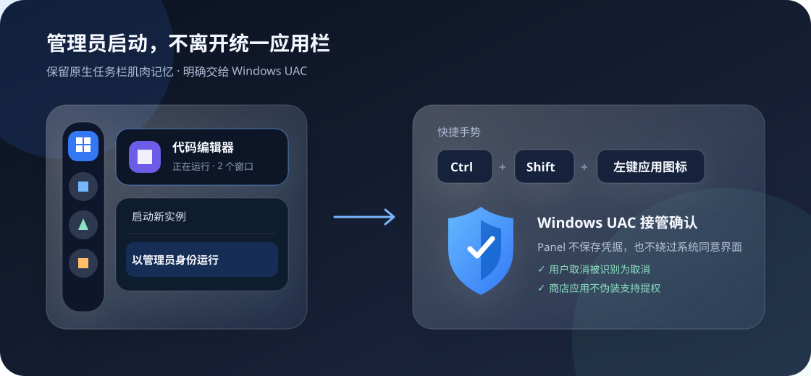
- 应用图标右键菜单会同时按需读取 Windows 公开 Jump List 的“最近项目”和“常用项目”：两类都有记录时优先各展示 4 项，一类不足时由另一类补足，总计最多 8 项；同一目标同时出现在 Recent 与 Frequent 时只保留一次，不让重复文件挤占菜单。点击文件时优先复用该应用的可靠启动目标，打包应用则交给 Windows 文件关联安全打开；单个分类读取失败不会吞掉另一分类。查询只在菜单打开期间运行于可取消的 STA 后台线程，关闭菜单、更新或退出会丢弃迟到结果；没有明确 AUMID 的应用不按名称猜测，也不读取 Explorer 私有数据。微软公开接口仅允许读取 Recent/Frequent，不能读取用户固定项、自定义分类或任务列表，Panel 明确保留此系统边界，依据见 [IApplicationDocumentLists](https://learn.microsoft.com/en-us/windows/win32/api/shobjidl_core/nn-shobjidl_core-iapplicationdocumentlists) 与 [GetList](https://learn.microsoft.com/en-us/windows/win32/api/shobjidl_core/nf-shobjidl_core-iapplicationdocumentlists-getlist)。

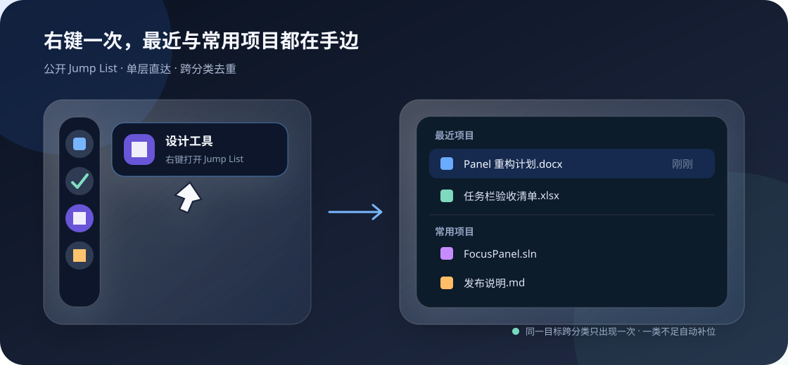
- 运行应用图标停留约 `420ms` 会打开无激活 DWM 实时窗口预览：画面由 Windows 桌面合成器持续提供，不截屏、不轮询，也不会抢走当前输入焦点；点击画面直接切换，底部标题栏可关闭窗口并标记当前窗口。目标显示器按物理高度和 DPI 自动容纳 1–4 张预览，其余窗口继续通过普通左键打开的完整应用窗口总览访问。DWM 关闭、远程桌面、受保护窗口或原生注册失败时，悬停自动退回文字窗口列表。
- 多窗口应用无需打开总览即可切换：`Ctrl+左键` 进入下一个窗口并首尾环绕，`Ctrl+滚轮`可双向循环；普通左键打开按应用身份精确筛选的完整窗口总览，普通滚轮仍只滚动应用栏。连续操作会记住刚刚选中的窗口，不等待 WinEvent 快照回写；滚轮使用 90ms 节流抑制高分辨率触控板抖动，单窗口应用不会吞掉应用栏滚动。悬停降级文字列表中可用中键或 `Delete` 直接关闭目标窗口，仍只发送正常 `WM_CLOSE`。
- 应用右键菜单中的每个窗口现在可直接“最小化 / 最大化 / 还原”，不必先切换窗口再寻找标题栏按钮；菜单根据该窗口当前状态只给出有效动作，单窗口与多窗口应用使用同一语义。执行复用集中式窗口命令边界，以 Windows 公开 `SW_MINIMIZE / SW_MAXIMIZE / SW_RESTORE` 设置状态，再用 `IsIconic / IsZoomed`确认真实结果；应用拒绝状态变化时显示失败，不把发出命令当成成功。成功后主动刷新窗口快照，最大化但前台未变化时菜单状态也不会陈旧；应用栏项目原位更新，不重建按钮或跳动滚动位置。公开定义见 [ShowWindow](https://learn.microsoft.com/en-us/windows/win32/api/winuser/nf-winuser-showwindow)、[IsIconic](https://learn.microsoft.com/en-us/windows/win32/api/winuser/nf-winuser-isiconic) 与 [IsZoomed](https://learn.microsoft.com/en-us/windows/win32/api/winuser/nf-winuser-iszoomed)。

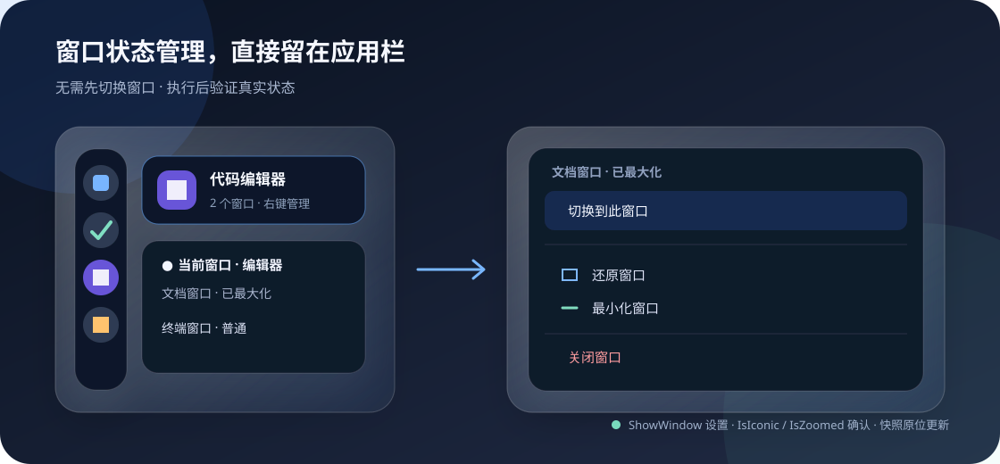
- 搜索结果和统一任务栏共用同一个应用图标组件；Shell 无法读取图标时显示带应用名称首字符的 Fluent 圆角占位，不再留下无法识别的空白按钮。中文、英文、数字和特殊字符名称均有稳定降级。
- 应用搜索按“完整名称 → 可执行文件名 → 名称前缀 → 缩写 → 多词前缀 → 包含”分级匹配；`vsc` 可命中 Visual Studio Code，`studio co` 可按词查找，标点、大小写和重音符号会被统一规范化。固定状态只在同一匹配等级内作为次级排序，不会再把固定但弱相关的结果压到精确结果前面；不做易误启动的无限模糊纠错。
- 搜索顶部提供“全部 / 窗口数量 / 应用 / 系统”四个可见范围。点击“窗口”无需输入即可浏览所有已跟踪窗口，当前窗口置顶，点击直接切换；输入标题可继续筛选。点击“系统”可直接浏览管理入口；“全部”继续把应用、已打开窗口、待办和系统命令放在同一条结果列表中。输入“任务管理器”“设备管理器”“硬盘分区”“admin terminal”或 `taskmgr`、`devmgmt` 等命令名可执行管理工具；输入 `>` 进入 Panel 原生运行模式，例如 `> notepad` 或 `> "D:\Tools\app.exe" --safe`，不再唤起 Win+R，也不经过 `cmd.exe`。搜索“快捷设置 / Win+A”“键盘 / Win+Space”“音量混合器”“电池”或“Panel 通知”会直接打开 Panel 对应详情；通知中心、小组件和任务视图的 Shell 调用链已经移除。截图、投影、无线显示和显示桌面继续作为独立系统能力提供。媒体命令支持上一首、播放/暂停和下一首。


这些组合采用微软公开的 Windows 11 行为，参见 [Windows 键盘快捷方式](https://support.microsoft.com/zh-cn/windows/windows-%E4%B8%AD%E7%9A%84%E9%94%AE%E7%9B%98%E5%BF%AB%E6%8D%B7%E6%96%B9%E5%BC%8F-dcc61a57-8ff0-cffe-9796-cb9706c75eec)；虚拟键值使用 Windows SDK 公布的 [Virtual-Key Codes](https://learn.microsoft.com/windows/win32/inputdev/virtual-key-codes)。
- 搜索框也可直接安全计算：支持括号、`+ - * / %`、小数、负数以及 `× / ÷ / （ ）`，结果固定显示在首位，点击或按 Enter 即复制。解析器不执行脚本或动态代码，最多接受 128 字符和 16 层括号；纯数字、路径、应用名、除零、指数语法和错误表达式不会伪装成结果。剪贴板被占用时会异步重试三次，持续失败才进入状态中心说明，不冻结搜索输入。
- 统一搜索可以直接控制默认输出音量：输入 `音量 35` / `volume 35` 精确设置百分比，输入 `音量 +10`、`音量降低 5` 或 `volume up 10` 相对调整，输入“静音 / 取消静音”直接设定目标状态。结果固定排在普通应用前，点击或按 Enter 后进入既有串行 Core Audio 控制器，无需先展开状态中心；正音量会同时取消静音，结果按 `0–100%` 夹取，设备切换或写入失败仍由状态中心给出可恢复说明。相对调整只在当前默认设备音量已确认时执行，不会在启动读取完成前把未知音量误当成 0%；解析只接受完整、明确的命令，`音量`、`音量 101`、小数、文件名和尾随文本不会被误执行。
- 状态中心新增内置显示器亮度滑块，不再为了调光先打开 Win+A；统一搜索同步支持 `亮度 35`、`亮度 +10`、`亮度降低 5`、`brightness 60` 和 `brightness down 10`。连续拖动只保留最新目标值并在后台串行写入，旧结果不能覆盖新的滑块位置；读取与写入使用 Windows 公开的 `WmiMonitorBrightness` / `WmiMonitorBrightnessMethods`，只控制系统实际公开的内置显示设备。外接显示器、远程桌面或驱动未公开亮度能力时，控件会禁用并说明原因，不调用 DDC 私有协议、不自动弹出快捷设置，也不假装成功。


- 状态中心内置应用级音量混音器：直接列出默认输出设备上尚未过期的音频会话，显示正在播放状态，并为每个应用提供独立音量与静音，不必再从任务栏打开快捷设置、进入声音混合器。活动会话优先、名称与会话实例标识稳定，最多显示 12 项并由状态中心整体滚动；系统声音使用明确标签，受保护进程无法读取产品名时降级为进程名，不按窗口标题猜测身份。滑块连续变化按会话合并最后值，不同应用严格串行；写入期间暂停旧快照覆盖，当前会话结束或设备切换时回滚到最后确认值并刷新列表。实现仅使用 Windows 公开的 `IAudioSessionManager2`、`IAudioSessionEnumerator`、`IAudioSessionControl2` 和 `ISimpleAudioVolume`，不读取播放器私有数据，也不影响独占模式音频流。


- 状态中心新增 Wi‑Fi 与蓝牙直接开关：打开状态中心即可按当前真实 Radio 状态开启或关闭，不再先展开 Win+A。第一次主动切换时才请求 Windows 无线控制权限，并在本次会话复用结果；系统仅接受请求还不算成功，Panel 会重新读取最终硬件状态后再更新按钮。飞行模式、硬件开关、驱动或组织策略禁用、权限拒绝和设备移除都会留在 Panel 内显示具体原因，不自动弹出任务栏快捷设置。实现使用 Windows 公开 [`Radio.GetRadiosAsync`](https://learn.microsoft.com/en-us/uwp/api/windows.devices.radios.radio.getradiosasync)、[`Radio.RequestAccessAsync`](https://learn.microsoft.com/en-us/uwp/api/windows.devices.radios.radio.requestaccessasync) 与 [`Radio.SetStateAsync`](https://learn.microsoft.com/en-us/uwp/api/windows.devices.radios.radio.setstateasync)，不读取 Explorer 托盘私有数据。


- 状态中心直接完成 Wi‑Fi 生命周期：用户点击“查找网络”后才扫描，附近网络按“当前连接优先、信号强度、名称”稳定排列并最多显示 10 项；Windows 已保存但当前不在附近的配置另列最多 6 项。已保存网络可连接，当前网络可断开，任意非策略配置可经确认后忘记；首次连接开放网络或 WPA/WPA2/WPA3 Personal 也直接在 Panel 完成。连接、断开和删除都必须重新读取到 Windows 真实状态才显示成功；网络离开、权限拒绝、Radio 关闭、WLAN AutoConfig 停止或超时都会保留列表并说明原因。密码不进入 FocusPanel 数据库、设置或日志，临时字符缓冲区提交后立即清零。
- Windows 11 24H2 会把附近 Wi‑Fi 列表作为精确位置能力管理；首次扫描可能出现一次系统授权，拒绝时 Panel 显示“打开位置权限”，直达“设置 > 隐私和安全性 > 位置”。依据见微软的 [Wi‑Fi 访问和位置行为变更](https://learn.microsoft.com/en-us/windows/win32/nativewifi/wi-fi-access-location-changes)、[`WlanScan`](https://learn.microsoft.com/en-us/windows/win32/api/wlanapi/nf-wlanapi-wlanscan)、[`WlanGetAvailableNetworkList`](https://learn.microsoft.com/en-us/windows/win32/api/wlanapi/nf-wlanapi-wlangetavailablenetworklist) 与 [`WlanConnect`](https://learn.microsoft.com/en-us/windows/win32/api/wlanapi/nf-wlanapi-wlanconnect)。FocusPanel 不导出 Wi‑Fi 配置、不读取明文密钥，也不注入 Explorer 网络面板。


- 媒体播放也不再依赖原生快捷设置：状态中心提供上一首、播放/暂停、下一首三个 44px 直接按钮，成功后保持状态中心打开，便于连续切歌；紧凑栏状态按钮中键可从任意应用一击播放或暂停，滚轮直接调音量，右键菜单也明确提供播放/暂停和静音。统一搜索同步支持“上一曲”“播放暂停”“下一首”及英文 `previous track / play pause / next track`。执行使用 Windows SDK 公开的 `VK_MEDIA_*` 虚拟键和现有批量 `SendInput` 按下/释放链，不枚举、注入或读取播放器私有数据；系统阻止模拟输入时进入状态中心明确提示。


- 统一搜索也能一步开始专注：输入 `专注 25`、`开始番茄钟 45 分钟`、`focus 30 min` 或 `pomodoro 60`，按 Enter 后直接复用现有番茄钟状态机设置 1–180 分钟并开始，无需先打开工作区、番茄钟页面和时长按钮。计时浮窗初次显示不抢走当前激活窗口；运行中或已经暂停的会话绝不会被新命令重置，而会打开番茄钟工作区让用户继续处理。解析要求完整命令与显式时长，裸“专注”、越界值、小数、文件名和尾随文本不会启动计时。
- 统一搜索还能一步收集任务：输入 `任务 买牛奶`、`待办：回复邮件`、`todo book dentist` 或 `task: prepare release`，按 Enter 后直接保存为 Inbox 下的待处理任务，成功时在 Panel 左侧显示可点击 Toast，无需进入任务页。主壳与任务页共享同一个 `TaskService` 串行写入闸门；任务页若正显示 Inbox，新任务会按持久化后的 Id 唯一增量插入，其他范围不会被打扰。标题限制 120 个字符且拒绝换行、控制字符、空内容和尾随伪命令；英文 `task manager` 明确保留给系统任务管理器，只有带冒号的 `task:` 才表示收集。
- 已有待办也进入同一搜索入口：输入任务标题或所属项目名称会匹配未完成任务，按 Enter 直接切到对应项目并打开任务详情；右侧勾选按钮则在搜索结果内直接完成，不必先打开工作区或任务页。索引只在搜索打开时通过共享 `TaskService` 后台刷新，输入期间只过滤内存快照，不会每按一个键就访问 SQLite；空查询不会展示任务列表。任务被其他位置删除、读取失败或保存失败时会保留最后有效快照并给出明确反馈，退出会等待已接收的搜索与完成操作。


- 搜索结果和任务列表统一继承全局 Fluent `ListBox/ListBoxItem`：启动按钮与标题显式使用动态 `FocusTextBrush`，选中项使用 `FocusAccentSoftBrush`、强调描边和主题文字，不再落回 WPF 的系统浅蓝选择背景，因此深色、浅色及系统强调色变化下都保持可读。
- 任务标题、完成状态和自定义字段采用 180ms 合并保存；根任务、子任务、增删改和全局字段通过同一个后台数据库闸门严格串行，每次操作创建并释放自己的短生命周期 `AppDbContext`，读取使用无跟踪快照。页面切换会先排空旧范围修改，退出会等待已入队保存完成，避免快速输入触发 EF 并发异常、跨操作跟踪污染或丢失最后一次修改。
- 任务 Markdown 图片选择完成后，目标目录创建、唯一文件名生成和文件复制全部在工作线程执行；网络盘、云盘占位图片和大文件不会冻结任务详情。任务在复制期间被关闭或切换时，迟到结果不会写入新任务；点击 Markdown 图片也复用后台 Shell 打开边界，失效关联不会造成 Panel 闪退。
- 开始菜单快捷方式、`shell:AppsFolder` 和应用身份解析在可取消的 STA 后台线程构建；Panel 壳层不再等待完整目录扫描才响应鼠标与键盘。
- 搜索和固定项会先显示名称与首字符占位，再由单一后台队列按需加载真实图标；Shell 图标提供器响应缓慢时不会卡住搜索输入。索引期间显示“正在载入应用目录”，完成但无匹配项时显示明确空状态。
- 打开搜索后会立即聚焦并全选搜索框；无需离开键盘即可用上下方向键选择结果、回车启动，`Esc` 关闭后焦点返回紧凑栏搜索入口。应用目录在后台补全时会按稳定身份保留当前选择，不会把光标跳回第一项。
- 窗口前台状态改变时按应用身份增量更新图标，只替换真正变化的项目，不再清空并重建整条应用栏，因此滚动位置和未变化图标保持稳定。
- 同一运行应用的活动状态、窗口标题和窗口数量改为在原有任务栏项目上原位同步；WPF 不再因前台切换执行集合 `Replace`、销毁按钮并重新创建视觉树，当前应用状态条和工具提示可以平滑更新。
- 应用数量超过紧凑栏高度时，切换到可视区外的应用会自动以最小距离滚动到完整可见位置，并为上下悬浮导航各保留 30px 安全区；已经可见的活动图标不移动。触发依据是稳定应用身份，同一应用内部切换窗口、标题变化或用户手动浏览时不会反复抢回滚动位置。
- 应用栏溢出后，拖动固定项或未固定运行项到可视区上下边缘会渐进自动滚动：越靠近边缘速度越快，离开感应区立即停止，45ms 节流避免高刷新率鼠标导致跳跃。整个拖拽会话持有 Panel 临时交互锁，拖到视口外、取消或放下时不会被自动收起；运行项跨视口放下后仍按原语义自动固定并保存顺序。
- 应用栏聚焦后提供完整纵向键盘导航：`↑ / ↓` 逐项移动，`Home / End` 到首尾，`PageUp / PageDown` 使用扣除上下溢出按钮后的真实可视数量翻页。边界不会把焦点送到其他模块；每次移动都复用最小滚动揭示，并在 WPF 默认聚焦滚动后再次校正，保证目标图标不被悬浮箭头遮住。两个箭头只负责鼠标滚动，不占用 Tab 停靠点。
- 拖到固定图标上半区时在其顶部显示 3px 强调色插入线并插到之前，拖到下半区则在线条下方插到之后；向上、向下移动都会按移除源项后的真实索引计算，不会错一位。未固定运行区不伪造任意插入位置，只有固定区与运行区的真实边界显示提示；在其他运行项上放下仍按既有语义追加到固定区末尾。
- 固定应用不再只能拖拽排序：右键菜单提供“上移固定应用 / 下移固定应用”，键盘聚焦图标后可直接使用 `Alt+↑ / Alt+↓`。首项和末项会按真实边界禁用不可用方向；菜单、快捷键和拖拽请求都进入应用目录的同一异步写入闸门，在最新持久顺序上计算，不会因快速连续操作使用旧索引覆盖新结果。
- 窗口跟踪覆盖 `CREATE / DESTROY / SHOW / HIDE / NAMECHANGE / FOREGROUND` 完整生命周期；新应用窗口创建后及时进入统一应用栏，最后窗口销毁后及时移除，不再依赖下一次偶然的前台或标题事件纠正陈旧图标。
- 顶层窗口枚举、AUMID/进程身份解析和图标提取通过单消费者后台快照执行，不再占用 WPF 界面线程；窗口事件在捕获期间继续到达时只保留一次尾随刷新，并用修订号拒绝旧结果、隐藏后的迟到结果和退出后的回调。
- WinEvent 只接收 `OBJID_WINDOW` 窗口本体并跳过 FocusPanel 自身进程；按钮、菜单和 Panel 显隐不会触发无意义的完整窗口重扫，短时间重复通知继续合并为一次刷新。
- 窗口枚举采用最后有效快照提交：`EnumWindows` 整体失败时保留当前应用栏，不把系统瞬时错误显示成“所有运行应用消失”；单个受保护窗口的进程、身份或图标读取失败只降级该项目，不中断其他窗口。
- `SnapshotChanged` 按订阅者隔离发布，一个界面监听器异常不会阻断其他状态消费者，也不会反向终止窗口枚举。退出时先标记跟踪器失效、停止计时器并解除 WinEvent；已经在途的原生回调会在 Dispatcher 关闭前静默丢弃。
- Panel 隐藏后暂停完整窗口枚举、时钟、系统状态和任务摘要刷新；右缘热区、全屏抑制、安全恢复和 GitHub 更新检查继续运行。再次唤出时先刷新窗口快照和当前时间，状态中心与日历在打开时即时刷新。
- 音频、网络、输入法和电池状态通过单消费者后台快照读取；刷新期间的重复请求合并为一次尾随刷新，只有最终快照回到 WPF Dispatcher 后才更新界面。设备读取失败不会阻塞悬停呼出，退出后的迟到结果会被丢弃。
- 待办数量和日历 42 天专注摘要也在工作线程使用独立 `AppDbContext` 查询；快速翻月时旧月份结果不会覆盖当前网格，SQLite 临时繁忙时保留最后有效摘要而不是闪成 0 项。
- 固定应用在后台读取后保存为线程安全内存快照；前台切换、窗口标题变化及窗口创建/关闭只组合缓存与运行窗口，不再在 WinEvent 高频路径上反复打开 SQLite。固定、取消固定和拖动排序也通过专用后台闸门串行提交，成功后才原子替换缓存；拖放提交期间保持 Panel 展开，退出会等待在途写入完成。
- 主壳启动时在工作线程用一个无跟踪快照读取首次引导、任务栏替代、主题和全屏热区设置，不再阻塞 `MainViewModel` 构造或为四个键重复打开 SQLite。窗口在快照就绪前保持隐藏，热区、托盘唤出和全局快捷键不会提前展开；就绪后才创建热区并决定显示引导或申请一次任务栏接管。运行中写入继续按设置键合并并由单消费者后台队列串行落盘。
- 任务栏控制器构造只校验恢复会话路径，不再在普通启动期间同步创建 `%LOCALAPPDATA%\FocusPanel` 目录；只有用户真正启用替代模式时，才在隐藏原任务栏之前准备目录并写入恢复快照。任一步失败都会中止接管，避免出现“任务栏已隐藏但没有可恢复会话”。
- 安全退出采用两阶段关闭：先恢复原生任务栏、停止热区和新的界面操作，再异步排空音频控制、开机启动设置、任务、桌面布局、番茄钟、固定应用与 Shell 设置；完成后才真正销毁窗口。慢磁盘或最后一次拖拽保存不会冻结 WPF Dispatcher，重复退出也只等待同一事务。
- 正常启动会先在当前线程幂等恢复遗留任务栏会话与原生桌面图标，再把 SQLite 在线启动备份、完整性检查、手工建表、异常库归档和备份恢复作为一个不可拆分事务交给后台协调器。WPF Dispatcher 不再被大数据库或慢磁盘占住；事务通过后才创建主壳，恢复提示与安全停止提示仍回到界面线程显示。
- 数据库后台事务开始前立即显示现有的 `3px` 右缘指示条，并以低亮度呼吸表示“FocusPanel 正在启动”；系统启用减少动态效果或高对比度时使用稳定亮度。它保持点击穿透、无激活和不抢焦点，也不会提前创建热区；主壳就绪后直接接管同一个窗口并切换为稳定运行指示，避免关闭、重建或边缘闪烁。数据检查失败时先关闭指示条再显示安全提示。
- Windows 开机启动项的初始注册表读取、启用、禁用和失败复读全部通过串行后台协调器执行，主壳构造与设置开关不再同步访问注册表。快速连续切换会按请求顺序写入并以最后选择为准；启动期迟到读取不能覆盖用户操作，写入失败则回滚到后台复读的真实状态，退出前排空已接收的修改。
- 番茄钟历史统计在工作线程加载；倒计时归零时立即更新界面、播放提醒并把完整会话交给后台单消费者串行保存。开始新一轮、暂停或重置后，上一轮迟到的保存结果不会覆盖当前提示，退出前会排空已经进入队列的会话。
- AI 页面打开时异步读取加密凭据状态与模型配置，不再在构造 WPF 工作区时同步打开 SQLite；发送前解密、保存模型和清除凭据也通过同一个后台闸门严格串行。配置仍使用当前 Windows 用户的 DPAPI 加密，数据库键名与既有数据完全兼容。
- 未运行的固定项点击启动；单窗口应用点击激活/最小化；多窗口应用左键打开按身份筛选的完整窗口总览，可直接使用实时预览、切换、关闭、状态及跨屏操作。右键菜单继续提供启动新实例、固定、逐窗口管理和关闭全部窗口。
- 应用图标支持 Windows 任务栏常用的新实例手势：`Shift+左键` 或鼠标中键直接启动新实例；没有可靠启动目标的受保护窗口不会显示或执行该动作。工具提示和读屏帮助会同步说明当前可用操作。
- 可把 Explorer、桌面或文件管理器中的文件和文件夹直接拖到统一应用栏图标上，用该应用打开；目标图标只显示一层 Fluent 强调反馈，且不会把外部文件误判成固定项排序或桌面收纳。普通可执行文件与快捷方式在后台一次接收最多 32 个路径，尾部反斜杠和空格会按 Windows 命令行规则正确转义；打包应用使用公开的 [`IApplicationActivationManager::ActivateForFile`](https://learn.microsoft.com/zh-cn/windows/win32/api/shobjidl_core/nf-shobjidl_core-iapplicationactivationmanager-activateforfile) 文件激活合约。不存在、不可访问或超出上限的项目会给出部分成功/失败 Toast，退出前会排空已进入边界的打开请求。
- 多窗口列表精确标记当前前台窗口；同一应用内部切换窗口也会增量更新标记。标题超过 340px 时视觉省略，读屏名称仍保留完整标题并说明“当前窗口”。
- 开始按钮右键、应用管理、多窗口列表、关机子菜单和托盘菜单统一使用单层 Fluent 圆角菜单；静态 XAML 项显式引用主题，运行时创建项会在创建、挂载和打开三个阶段重新确认应用级 Style。独立 Popup 使用不透明的专用深浅主题表面，并覆盖 WPF 系统菜单的后备背景、文字与选中色；即使 Popup HWND 创建期间短暂解析到系统模板，也不会再出现透明浅底、白字或直角亮蓝选中条。
- 菜单悬停、键盘焦点、当前窗口勾选、禁用状态和子菜单箭头全部使用动态主题令牌；子菜单保持文字省略与完整辅助功能名称，不增加黑色投影边框。
- 全部工具提示使用单层 Fluent 圆角表面，背景、文字和描边跟随动态深浅色主题；不再复用 WPF 默认矩形模板、硬编码深色底或系统黑色阴影。应用状态与新实例手势等多行提示也保持同一信息层级。
- 主题、AI 模型和任务字段等下拉选择统一使用非编辑式 Fluent ComboBox：封闭状态、箭头、键盘焦点、选中标记和展开 Popup 共用动态主题令牌，设置页不再漏回系统默认浅色直角控件。
- 设置选项、AI 数据授权、任务完成和多选字段统一使用 Fluent CheckBox：20px 圆角标记位于至少 44px 点击区内，悬停、按下、选中、不确定和禁用状态均使用动态主题，不再混入系统方框或蓝色勾选样式。
- 主壳、Focus/状态中心、桌面收纳、任务、AI 和所有弹层统一使用 10px Fluent 滚动轨道。
- 状态中心音量使用 44px 交互高度的 Fluent Slider；电池、更新和番茄钟统一为圆角 Fluent ProgressBar。
- 搜索、任务、桌面重命名、AI 输入和密钥字段统一使用 Fluent 输入系统。
- 桌面收纳工具栏开关和文件选中态统一使用跟随 Windows 的柔和强调色。
- 右缘运行指示、桌面重命名遮罩和 Explorer 系统限制警告均使用动态状态令牌；浅色桌面上的边缘提示、警告文字对比度及遮罩层级不再依赖页面硬编码颜色。`Views/` 中的 XAML 禁止直接写十六进制颜色。
- 主壳、六个业务工作区、日历、任务详情和浮动番茄钟统一使用语义字体层级：页面 28px、章节 18px、卡片 15px、正文 13px、说明 12px、元信息 11px；指标与计时使用 Segoe UI Variable Display，图标和紧凑栏时间保留专用尺寸。
- 应用搜索整行启动、普通操作和退出/关机/删除/清除凭据等危险操作共用 Fluent 单层按钮模板；危险按钮使用动态柔和背景与危险前景，深色、浅色和高对比度均保持可读，页面不会再回退到 WPF 原生矩形按钮。
- 删除任务、清除凭据、自动整理、数据库恢复、电源和软件更新等运行期提示统一使用 FocusPanel Fluent 模态对话框：复用 DWM 原生圆角与毛玻璃、动态主题、语义图标和统一按钮。危险确认默认聚焦安全的“否”，长更新说明可滚动；只有应用资源尚未建立的灾难恢复阶段才使用系统提示兜底。
- 模态对话框显示期间会持有 Panel 的临时交互锁，背后的工作区不会因窗口失焦自动缩回；确认、取消、关闭和异常路径都会幂等释放。应用搜索整行按钮与“最近使用”入口也提供随内容变化的读屏名称。
- 任务设置中的图片保存目录使用 Windows Shell 原生现代文件夹选择器，不再弹出老式 WinForms 树形窗口；选择器定位当前目录、归属 FocusPanel 窗口并保持 Panel 展开，取消不修改设置，保存失败会回滚原路径。
- Markdown 插入图片同样通过可替换的 Windows 现代文件选择边界：选图窗口归属当前 FocusPanel 窗口，期间保持 Panel 展开；中文过滤器只显示支持的图片，取消不会改写正文，错误进入统一 Fluent 提示。
- 应用图标左侧使用任务栏式圆角状态条：后台运行显示 `4×12px` 短条，当前活动扩展为 `4×24px` 长条并使用单一柔和背景，固定但未运行的应用不显示状态条。状态层完全点击穿透，不会吞掉图标左缘操作。
- 工具提示和读屏名称明确区分“已固定 · 未运行”“后台运行 · 1 个窗口”“已最小化 · 1 个窗口”“正在使用 · 2 个窗口”；辅助操作提示会按启动、还原、切换、最小化和应用窗口总览准确变化，窗口预览同时显示当前、最小化、最大化及置顶状态。
- 应用启动会区分普通可执行文件、快捷方式、Shell 路径和 `shell:AppsFolder` 返回的 AUMID；商店应用不再把 AUMID 错当文件名。应用已卸载、固定路径移动或 Shell 拒绝启动时不会让 Panel 闪退，而是在状态中心说明原因并引导重新固定。
- 搜索结果、固定应用和“启动新实例”的 Windows Shell 启动全部在工作线程执行；网络快捷方式或 Shell 宿主响应缓慢时不会冻结 Panel。连续点击允许并发启动，等待中的旧结果不能覆盖最后一次点击的成功/失败反馈；传入工作线程的是不含 WPF 图标的纯启动快照。
- 窗口切换、最小化和关闭会检查 Win32 的真实结果；Windows 拒绝前台切换、窗口已失效或关闭消息未能入队时，状态中心会显示对应窗口和原因，不再表现为点击后毫无反应。
- 固定、取消固定和拖动排序会确认 SQLite 提交结果；数据库短暂锁定或写入失败不会冲击 UI 线程，也不会把未保存的顺序伪装成成功。
- 运行项可通过右键固定；拖动未固定运行项会自动创建固定项并保存排序，取消固定后只要窗口仍在就继续显示。
- 紧凑栏从上到下固定为开始、搜索、统一固定/运行应用列表、桌面收纳、任务、状态和时间；六个固定入口顺序稳定，中部应用区独立滚动。普通滚轮始终滚动应用列表，`Ctrl+滚轮`才在鼠标所指的多窗口应用中循环窗口。
- 多屏定位以 Windows 主屏的物理边界和主屏 DPI 为唯一基准；紧凑栏、展开动画、12px 热区和 3px 指示条不会混用窗口当前屏的 WPF DIP。主屏存在负坐标、位于副屏右侧或采用不同缩放时，Panel 仍完整向主屏内部展开。
- 中部应用列表超出可视高度时显示轻量悬浮上下导航；到达顶部或底部后相应箭头自动消失，点击按一个应用图标步长移动，鼠标滚轮仍可直接滚动。
- 展开工作区直接显示概览、桌面收纳、任务、番茄钟、AI 和设置六个一级入口，并以唯一选中态明确当前位置；紧凑栏“收纳”和“任务”普通点击分别直达两个最高频工作区。状态中心继续集中音量、静音、网络、电池、通知、输入法、显示桌面和电源操作。
- 状态中心首屏优先提供 Panel 自有后台与窗口、网络与无线、应用音量、媒体与电池、输入法、Panel 通知、显示桌面、锁定、电源、主音量和亮度；五组详情互斥展开并显示选中态。Panel 通知跨重启保存最多 50 条更新、任务、番茄钟和恢复消息，紧凑状态入口直接显示未读徽标，`Shift+点击 / Shift+Enter` 一步打开或收起通知详情。打开详情不自动清除未读，可只看未读、逐条已读或删除，也可全部已读和清空；通知管理全程留在 Panel，不再提供 Win+N 兼容入口。系统操作均返回明确结果；成功后保持当前状态中心便于连续调整，系统拒绝或启动失败时留在 Panel 显示原因。
- Panel 开始、统一搜索和 `>` 运行模式均由 Panel 自己承载；Win+X 风格管理工具、电源设置、显示桌面、锁定、睡眠以及确认后的重启/关机通过后台系统动作协调器执行。Win+W 小组件入口已删除。
- 音量和静音使用一次性 Core Audio 快照区分“真实 0%”与“没有默认输出设备”；端点切换或写入失败时滑块回到最后确认值并显示原因。无输出设备时控件自动停用，设备恢复后由状态刷新重新启用；紧凑栏滚轮只有在音量写入成功后才会取消静音。
- 音量 Slider 的高频变化、静音点击和紧凑栏滚轮改由单消费者后台控制器执行；等待中的音量请求只保留最终值，音量与静音严格串行。每次工作线程操作独立初始化 Core Audio COM、创建并释放端点枚举器，旧修订结果不会覆盖新操作；写入期间暂停旧状态快照回填，最新请求失败才回退到最后真实成功值并提示。
- 紧凑栏状态入口和状态中心静音按钮会根据当前音量显示 Segoe Fluent 音量、静音或设备不可用图标；紧凑栏短标签同步显示百分比、“静音”或“不可用”，工具提示和读屏名称继续提供网络、音频与电池完整摘要。Panel 从隐藏状态重新唤出或鼠标移入状态入口时通过同一合并队列刷新一次，不需要先打开状态中心，也不会在隐藏期间常驻轮询。
- 电池状态通过单次快照同步读取是否存在、百分比和充电状态；紧凑栏状态入口的一个提示整合网络、音量与电池，不再为每项状态增加独立按钮。
- 网络状态通过单次快照生成可用性、连接类型、接口名称和详情；状态中心按无线、有线、其他连接显示 WiFi、Ethernet 或 Globe 图标，离线时显示 Error。接口切换或枚举失败不会再把不同采样时刻的在线/离线文案拼在一起，也不读取 Explorer 私有托盘数据。
- 输入法详情通过微软公开的 [`GetKeyboardLayoutList`](https://learn.microsoft.com/en-us/windows/win32/api/winuser/nf-winuser-getkeyboardlayoutlist) 枚举系统当前输入区域，显示“中 / 拼”“中 / 五”“EN”等简称、完整输入法名称和当前项；选择后向用户刚才使用的外部窗口投递 [`WM_INPUTLANGCHANGEREQUEST`](https://learn.microsoft.com/en-us/windows/win32/winmsg/wm-inputlangchangerequest)，并短时读取目标线程的实际布局确认结果。相同语言的多个输入法按真实布局句柄区分，过期布局不会执行；目标窗口关闭、权限隔离、尚未处理或拒绝请求时留在 Panel 内提示，详情底部不再放置 Win+Space 系统浮层入口。
- 时间入口提供周一开头的 6 周月历，可切换月份、回到今天或直接选择日期；方向键按日/周移动，`PageUp` / `PageDown` 跨月，`Ctrl+Home` 回到今天，键盘焦点始终跟随所选日期。`Shift+左键`、`Shift+Enter` 或中键可一步切换显示桌面；右键菜单同时提供显示桌面、Windows 日期时间与通知设置。完成过番茄钟的日期显示专注圆点，底部汇总所选日期的专注次数和分钟数。
- 后台发现 GitHub 新版本后，紧凑栏“收纳”入口显示更新状态点；点击展开工作区后，顶部“设置”入口直接进入一键更新，不依赖托盘气泡或重复更新卡片。
- Velopack 安装定位和更新管理器在共享工作线程准备，主窗口构造与 XAML 首帧不再等待安装目录扫描；首次自动检查和设置页手动检查都会等待同一个初始化结果，安装版不会因为准备尚未结束而漏掉开机后的更新。
- 更新包下载完成后，SQLite 完整性检查、在线备份和历史备份清理也在专用工作线程执行；设置页会保持忙碌与 Panel 交互锁，备份完成后才恢复原任务栏、桌面图标并启动 Velopack。准备失败会恢复右缘监测并显示原因，不会让界面停在“正在安全重启”或允许重复提交。
- 开始按钮左键打开 Panel 自己的完整应用目录，`Shift+点击 / Shift+Enter` 打开 Panel 统一搜索，不发送 Windows 键，也不查找或调用被接管的 `Shell_TrayWnd`；右键提供 Win+X 风格系统管理菜单，包括安装的应用、电源选项、事件查看器、系统、设备管理器、网络连接、磁盘管理、计算机管理、终端、管理员终端、任务管理器、设置和文件资源管理器。虚拟桌面的上一个、新建、下一个和关闭也位于该菜单内，关闭仍明确确认应用不会退出。
- 第三方仅托盘图标没有受支持的公共枚举接口，FocusPanel 不读取 Explorer 私有结构、不使用 UI Automation 点击原生溢出按钮，也不临时显示原生任务栏。状态中心的“后台与窗口”使用 Panel 自有窗口快照管理可操作应用。


### 无激活原生通知

更新可用和番茄钟完成不再依赖 Explorer 托盘气泡，而由 FocusPanel 在 Panel 左侧显示单层 Fluent Toast。通知复用 Windows 11 DWM 原生圆角与 Desktop Acrylic；显示时不激活窗口、不打断当前输入，鼠标悬停会暂停自动关闭。更新通知可直接进入设置页，专注完成通知可直接回到番茄钟。0.11.55 起 FocusPanel 不再创建任务栏托盘图标；原生任务栏恢复与安全退出由 Panel、watchdog 和紧急快捷键承担。


### 工作区与状态中心

“收纳”和“任务”按钮分别直接展开两个最高频工作区，标题下方固定显示概览、桌面收纳、任务、番茄钟、AI 和设置；六个入口共用单层分段导航且始终只有一个当前态，不再创建重复的 Focus 中心或“工作”中转菜单。状态中心只放设备状态、Windows 公开入口与任务栏恢复信息；首屏保留常用动作、主音量和亮度，网络与无线、应用音量、媒体与电池使用三个默认折叠的单层详情区。

“概览”以只读方式汇总未完成任务、今日专注和已收纳桌面项目，并显示可以立即推进的任务。它不会改变业务数据，打开或手动刷新时才读取最新本地快照。


### 月历与专注回顾

时间弹层只承载日期、专注历史和两个高频动作，不再重复堆放通知、桌面等状态中心入口。月历固定生成 42 个日期，避免不同月份打开时高度跳动；今天使用细描边，选中日期使用单一强调表面，相邻月份降低透明度。专注圆点与摘要直接读取现有 `PomodoroSessions`，不会创建新业务表，也不会修改历史记录。


## 侧边任务栏完整替代与安全恢复

完整替代模式会先保存主屏原工作区、AppBar 状态、任务栏可见性和原始 DWM app-cloak 位，再通过公开 [`ABM_SETSTATE`](https://learn.microsoft.com/en-us/windows/win32/shell/abm-setstate) 清除 `ABS_AUTOHIDE`、一次性把主屏工作区释放到完整显示器边界。随后通过公开 [`SetWindowRgn`](https://learn.microsoft.com/en-us/windows/win32/api/winuser/nf-winuser-setwindowrgn) 为主屏 `Shell_TrayWnd` 设置空窗口区域，并以公开 [`DWMWA_CLOAK`](https://learn.microsoft.com/en-us/windows/win32/api/dwmapi/ne-dwmapi-dwmwindowattribute) 增加独立的 DWM 合成隐藏层后隐藏宿主。即使 Explorer 的边缘手势重新设置逻辑可见位，任务栏仍没有可绘制、可命中或可呈现的表面。FocusPanel 不结束 Explorer、不修改副屏任务栏，也不读取 Explorer 私有结构。

稳定运行时守护器只读取 AppBar、工作区、宿主句柄、空区域和 DWM cloak 状态，不会周期性改写任务栏。启用接管现在要求空窗口区域或 DWM cloak 至少有一层经回读确认有效，不能再只靠容易被底边手势推翻的 `ShowWindow(SW_HIDE)` 假装成功。若 Explorer 在本次会话中重建宿主，或同时丢失所有持久抑制层，守护器最多执行一次受控修复：重新关闭原生自动隐藏边缘、恢复持久抑制并在确实可见时再隐藏一次，但不改写工作区。修复预算耗尽后再次失效会立即安全恢复，因此不会与 Explorer 形成无限隐藏/显示循环。

接管成功时会记录当前主屏 `Shell_TrayWnd` 句柄。Explorer 第一次重建宿主且主屏边界、完整工作区和安全会话仍一致时，单次修复会把持久抑制迁移到新宿主；同一会话再次重建或修复不能得到可验证结果时才报告“Explorer 宿主变化”并恢复。每次恢复和重新接管都会推进会话代际，已经在后台读取中的旧守护结果会自动作废，不会污染新会话或弹出迟到警告。

首次启用前会显示安全说明。只有在侧边壳层、热区以及独立恢复守护进程都就绪后，FocusPanel 才会隐藏原任务栏；紧急快捷键注册失败时不会改变任务栏设置。

“随 Windows 启动”只在用户明确勾选后写入当前用户 Run 键。FocusPanel 会创建缺失的注册表键、正确引用带空格的程序路径，并在权限或路径失败时显示原因、回滚复选框；不会静默显示成已启用。

- 紧急恢复：`Ctrl+Alt+Shift+F10`
- 正常退出、未处理异常、数据库恢复重启：均恢复原任务栏可见性与 AppBar 设置
- 父进程异常退出：`--taskbar-watchdog` 守护模式负责恢复
- Explorer 重启或任务栏状态改变：停止本次替代并恢复原设置，避免可见性循环
- 恢复会话：`%LOCALAPPDATA%\FocusPanel\taskbar-session.json`

遇到异常时，先按紧急恢复快捷键。仍未恢复可重新启动 FocusPanel；启动阶段会检查并恢复遗留会话。程序永远不会结束 Explorer，也不会持续覆盖 Windows 工作区。Panel 不拦截用户主动按下的 Windows 系统快捷键，但自身界面不发送 Win+A、Win+N、Win+W、Win+Space、Win+Tab 或 Win+D；FocusPanel 自己产生的更新、任务、番茄钟和恢复消息进入 Panel 通知历史，并在 Panel 内完成筛选、已读、删除和跨重启保存。读取其他应用的完整 Windows 通知需要安装包清单能力和用户授权，当前版本不伪装成已经接管。第三方托盘图标不会被复制，也不会通过原生任务栏抽屉伪装成 Panel 能力，后台可操作应用统一进入 Panel 自有窗口总览。


## 桌面收纳与效率模块

- 新收纳文件始终保留在原桌面路径，不改名、不移动；FocusPanel 保存原始文件属性并追加 `Hidden + System`，取消收纳时精确恢复原属性。
- 从 Windows 桌面把文件或文件夹拖入收纳分区，会立即执行同一套隐藏事务；其他目录的项目不会被擅自移动。
- Explorer 外部拖入会先在工作线程生成一次路径预检快照：规范化并按大小写不敏感身份稳定去重，再检查存在性并区分用户桌面、公共桌面和越界路径。拖放回调不再逐项同步访问磁盘；单个失效或无权限路径不会终止整批，缺失、越界、重复和授权取消会分别计数反馈。
- 普通“显示隐藏项目”开启时，已收纳图标仍会隐藏；如果同时开启“显示受保护的系统文件”，设置页会提示 Windows 无法保证图标不可见。
- 不再注入或持续修改 Explorer 的桌面列表；Explorer 刷新、重启和系统重启后按文件属性保持状态。
- 属性改变后会通知 Shell 更新项目并重新枚举桌面目录，避免图标只变成半透明却仍停留在桌面。
- 收纳时的文件存在检查、完整原属性读取、`Hidden + System` 写入及 Explorer 属性通知统一经过后台 I/O 边界，不再在 WPF 调用上下文同步访问文件系统；公共桌面的应用与失败回滚使用同一提权路径，避免属性已经改变但普通权限无法恢复。数据库仍先记录“收纳中”，成功后标记稳定，失败时恢复原属性或保留“需要恢复”记录。
- 用户桌面与公共桌面项目混合整理时，在任何属性写入前先确认公共桌面授权，只弹出一次 UAC，并为本批创建短生命周期属性会话。全部普通与公共快捷方式、文件夹和失败回滚复用该批次；授权取消时整批零写入，单项失败只进入最终统计，不会退出主程序。批次结束、主程序断开或助手异常时会话立即释放。
- 主壳刻意保持 `asInvoker`，不会在开机时整体请求管理员权限：这样普通权限 Explorer 仍可把桌面项目拖进 Panel，同时避免每次登录弹 UAC，以及把任务栏接管、更新、热区和业务数据库扩大到高权限进程。管理员助手只接受公共桌面根目录下的属性写入并逐项重新校验路径。
- 旧版 `.FocusPanel` 仓库继续兼容，升级时不自动移动旧文件。
- 不创建全屏桌面覆盖窗口；Windows 原生桌面保持可点击，文件收纳操作集中在侧边栏工作区完成。
- 桌面收纳工具栏、收纳盒、视图选项、新建、修复和重命名已全部使用共享 Fluent 控件；页面不再保留 Material 兼容控件或矩形/圆角双重外框。
- 桌面文件变化后按收纳盒身份和文件完整路径差量同步：未变化的收纳盒、卡片和展开状态保留原对象，文件移动只更新对应集合，列表不会因 `Clear()` 重建而自动跳回顶部。
- 桌面监控、拖入拖出、视图切换和手动刷新触发的分区重组不再在 WPF UI 线程读取全部 SQLite 分区与文件偏好；重复请求合并为后台快照，返回后继续使用差量同步器，因此大量记录下滚动、拖拽和 Panel 自动收起保持响应。
- 图标缩放、列表/网格、个性化/时间线和自动整理开关使用 180ms 合并式后台保存；快速连续调整只写入最后状态，数据库读写严格串行，退出前排空当前设置，保存失败会保留本次会话选择并显示提示。
- 新建、重命名、删除、拖拽排序、跨列移动和普通文件分类也统一进入同一个后台仓库闸门；操作成功后才刷新布局，失败时原界面和数据库保持原状并显示 Fluent 错误提示，退出前会等待已经进入仓库的写操作完成。
- 双击文件卡片和“打开桌面文件夹”不再从 WPF 命令同步调用 Windows Shell；每次打开请求独立进入工作线程，慢磁盘、离线路径或失效文件关联不会冻结收纳区。连续打开时只有最后一次请求可以显示失败提示，旧失败不会盖住用户后续的成功操作。
- 分区拖拽排序持有既有临时交互锁直到 SQLite 提交完成；这段时间 Panel 不会自动收起，重复拖拽不能并发改写顺序。跨列移动会同时连续重排来源列和目标列，不留下重复或跳跃序号。
- 左右列排序使用 `Move` 更新而非清空重加；同路径文件刷新保留选中状态。数据库瞬时读取失败时保留最后一次有效界面，不把暂时错误显示成“所有收纳盒消失”。
- 桌面根目录监视器会把 500ms 内重复的创建、写入、删除和重命名通知按路径合并，只读取真正变化的项目；旧仓库变化或监视器缓冲区异常时才安全回退全量扫描。
- “新增桌面项目自动按类型收纳”只处理开关开启后由监视器确认的新路径；普通内容变化、属性刷新、既有项目改名、启动扫描和错误恢复不会把原有桌面项目批量抓走。复制临时文件改名到最终名称时保留新增身份，取消收纳与救援工具创建的项目则明确跳过，避免恢复后立即被重新收纳。
- 自动收纳不会在后台弹出管理员授权窗口；Paint.NET 等位于 `C:\Users\Public\Desktop` 的快捷方式保持可见并记录精确待授权路径，“视图选项”会显示“授权收纳 N 个公共桌面项目”。用户主动点击后整批只请求一次 UAC；已有公共桌面项目也能通过可见候选扫描进入该入口。`Paint.NET.lnk` 不会命中 FocusPanel 自身入口排除规则。
- 自动收纳永久排除官方 `FocusPanel.lnk` 和当前运行的 `FocusPanel.exe`，不会把唯一启动入口藏进面板。若启动时发现旧版本曾误收纳自身入口，会按收纳记录保存的原始属性恢复当前属性模式收纳集中的桌面图标；无法恢复的项目保留“需要恢复”状态，不继续强制隐藏。
- 手动一键整理若包含公共桌面项目，会在任何文件属性写入前一次性说明并请求管理员授权；取消 UAC 或授权助手启动失败时整批零写入，普通桌面图标也保持原状。
- 自动收纳和手动一键整理都会登记为可等待操作；应用退出时先停止接收新批次并等待已开始的文件属性事务收尾，再释放监视器。进度渲染和文件列表订阅者各自捕获异常，单个卡片、迟到 Dispatcher 消息或观察者失败不会再触发整个 Panel 的全局闪退。
- 外部重命名、文件大小和类型变化继续复用原卡片并更新派生文本；已收纳文件外部丢失时保留“需要恢复”入口。退出应用会释放全部桌面监视器和计时器，不留下重复刷新源。
- 网格和列表模式使用与外层统一滚动条协作的视口虚拟化面板，只创建当前可见行和前后缓冲行的文件卡片；完整集合、滚动范围、双列收纳盒和业务排序不变。
- 文件卡片容器在滚动时回收复用，图标缩放、窗口宽度、收纳盒折叠和集合变化会重新计算实现区间。1000 项真实 WPF 冒烟中，首屏、中段、集合变化和返回顶部仅存在 `9/12/12/9` 个视觉容器。
- 网格与列表中的文件右键菜单按可视卡片隔离实例，并在每次打开时绑定当前右键目标；同时生成一份稳定的分区名称快照。点击“移动到”或“收纳到面板”会先关闭菜单，再用捕获的具体文件提交后台分类和差量刷新，不再枚举正在变化的实时分区集合，也不依赖可能被虚拟化替换的全局选中项；恢复操作同样直接携带当前文件。菜单显式使用同一套深浅色 Fluent 主题。
- 视图选项、新建收纳盒、收纳盒操作和修复工具使用单一活动弹层：打开新 Popup 会关闭旧 Popup，焦点进入首个可操作控件；在独立弹层内按 `Esc` 会关闭弹层并回到原触发按钮。文件右键菜单、模块切换和页面卸载也会清理活动浮层，不会让自动收起计数残留。
- 文件监控、手动刷新和自动整理后的刷新共享同一个串行闸门；收纳与取消收纳另用文件属性操作闸门。多次拖放、自动整理和拖出恢复不会并发改写同一项目，退出后的排队操作和迟到 Dispatcher 回调也不会继续触碰已释放界面。
- 主壳构造不再同步读取桌面收纳 JSON 设置或创建文件监控器；默认工作区先显示轻量 Fluent 加载状态，设置读取、旧目录检查和监控器准备在工作线程完成。准备期间切换到其他模块时，迟到结果只缓存不抢回页面；初始化失败会显示可读状态，退出后完成的实例会立即释放。
- 设置页用于提示收纳限制的“显示受保护的系统文件”状态也通过合并式后台刷新读取；启动和每次打开设置都不会同步访问 Explorer 注册表，关闭主壳后的迟到结果不会再修改界面。
- 任务模块使用统一 Fluent 表面，保留项目/子任务、列表和自定义字段语义；看板会按状态生成真实列，任务可前后移动、进入详情、进入子任务或删除。
- 任务详情使用 Windows 11 原生 DWM 毛玻璃窗口；关闭模块或切换数据上下文时同步解除订阅并关闭详情，避免重复窗口和失效对象残留。
- 番茄钟提供 25/45/60 分钟预设、准确剩余进度、暂停/继续、完成声音和无激活毛玻璃 Toast；悬浮计时器使用与主壳一致的 Windows 原生毛玻璃，不创建全屏覆盖层。
- 关键结果支持正向或反向目标，进度限制在 `0–100%`；目标总进度按正权重计算，新增、更新和删除会与数据库中的总进度一次提交。
- AI 助手提供中文 Fluent 对话、快速提示、可取消请求、提供方与模型选择；全新配置默认接入 DeepSeek Chat Completions，升级用户原有 OpenAI Responses 配置保持 OpenAI，不会被自动迁移或混用。
- DeepSeek 与 OpenAI API Key 分别通过 Windows DPAPI 加密，仅当前 Windows 用户可解密；切换提供方会清空尚未保存的密码输入，界面不回显已保存 Key，也不会写入日志。
- 桌面收纳保留两种分区方式：默认本地规则按图片、文档、视频等类型离线归类；用户在 AI 配置中主动开启后，DeepSeek 可依据文件名语义在现有自定义收纳盒和内置分区间选择。已有手动分区优先于 AI，AI 优先于本地类型回退。
- 桌面收纳工具栏始终显示带文字的“AI 智能分区”按钮；它会检查已经收纳且位于未锁定收纳盒中的项目，展示来源→目标预览后再请求确认。收纳盒菜单可“锁定 AI 调整”或重新允许，锁定状态持久化到 `DesktopPartitions.IsLocked`。
- AI 助手提供受控的桌面分区 Agent 动作：明确说“帮我智能分区”“重新分区”或“重新整理收纳盒”会生成同一份计划，并在对话区显示“取消/应用分区”。聊天中的附加要求会作为本次整理偏好进入计划，不再在触发后丢失。该接口只有计划与经确认应用两阶段，不允许模型直接写数据库。
- 智能分区发送经过长度限制的文件名、扩展名、项目类型和当前未锁定收纳盒名称，用整组现有布局作为个人分类样例；快捷方式只额外发送在本机解析出的目标应用名/AppUserModelID，不发送快捷方式或目标程序完整路径。模型只能选择现有允许分区，并为建议返回置信度和理由；低于 68% 的项目保持原位，未知分区和无效输出会被本地拒绝。项目超过 80 个时会分批完整规划，不静默截断。
- AI 默认无权读取 FocusPanel 数据。用户主动开启授权后，只附带任务标题与状态和近 7 天专注统计；不读取文件内容、文件路径、旧版 OKR 表或凭据。
- AI 助手保持只读，不直接执行删除、关机、外部发送、付费或修改任务等操作。
- 保留番茄钟完成会话统计、数据库备份与恢复。
- 新增固定应用持久化；`PinnedApps` 表由现有 `EnsureSchema()` 机制创建，不改动原业务表内容。


自动收纳的文件属性事务、监视器通知和布局刷新现在是同一条可观察异步链：服务先释放文件刷新闸门，再执行新增项目收纳；单个文件失败会留在桌面并进入结果摘要，末尾扫描或 SQLite 竞态也只会显示可恢复错误，不会再把异常抛给 WPF 全局退出策略。


文件较多时，工具栏下方会临时显示实时进度、当前项目和已处理数量；整理按钮同步禁用，防止重复点击排队。手动整理、自动新增收纳和公共桌面授权阶段各自使用独立进度修订，上一阶段迟到的 UI 消息不会覆盖最终摘要。


## 兼容性与视觉

- 推荐 Windows 11 22H2（Build 22621）或更高版本。
- 使用 DWM Desktop Acrylic、圆角和自定义 Fluent 资源，不再依赖 MaterialDesignInXamlToolkit。
- 跟随系统浅色/深色主题；高对比度、关闭透明效果、远程桌面或 DWM 不可用时降级为不透明主题。
- 启用 Per-Monitor V2 DPI，支持多显示器与不同缩放比例。
- 不镜像第三方托盘图标、不读取 Explorer 进程内存，也不调用 Explorer 的隐藏图标按钮；Windows 没有公开接口允许第三方完整接管其他应用的托盘菜单。可可靠管理的后台应用统一进入 Panel 自有窗口总览，窗口预览由公开 DWM 缩略图接口提供。

## 技术栈

| 模块 | 技术 |
| --- | --- |
| 框架 | C# / .NET 7 / WPF |
| 架构 | MVVM / CommunityToolkit.Mvvm |
| UI | 自定义 Fluent ResourceDictionary / DWM |
| 数据库 | SQLite / EF Core 7 |
| Panel 通知 | 自有无激活 Fluent Toast 与本地通知历史（无任务栏托盘图标） |
| 系统集成 | Win32 / DWM / AppBar / Core Audio / Shell |
| 安装与更新 | Velopack 1.2 / GitHub Releases |

## 项目结构

```text
FocusPanel/
├─ Views/        # 壳层和业务页面
├─ ViewModels/   # MVVM ViewModel
├─ Models/       # EF Core 实体和 DTO
├─ Services/     # 壳层协调、系统集成与原有业务逻辑
├─ Data/         # AppDbContext 和 EnsureSchema 手工迁移
├─ Helpers/      # 桌面、图标及 Win32 互操作
├─ Themes/       # Fluent 设计令牌与控件样式
├─ Controls/     # 项目自有兼容控件
└─ Tests/        # 不触碰真实任务栏的单元测试
```

## 构建、测试与运行

```bash
dotnet build FocusPanel.csproj
dotnet test Tests/FocusPanel.Tests.csproj
dotnet run --project FocusPanel.csproj
```

要求：

- Windows 11
- .NET 7 SDK
- 仓库没有 `.sln` 文件，直接构建 `FocusPanel.csproj`

数据库位于 `%APPDATA%\FocusPanel\focuspanel.db`。启动备份使用 SQLite 在线备份 API，因此 WAL 中已提交的数据也会进入独立备份文件。恢复时先安全退出当前实例并恢复原生任务栏，再由交接进程等待单实例锁释放；候选备份跨 AppData 与安装目录按时间排序并逐个执行 `PRAGMA quick_check`，最新文件损坏时会回退到更早的有效备份，全部失败则保持当前数据库不动。

未处理异常会先恢复原生任务栏和桌面图标，再写入 `%LOCALAPPDATA%\FocusPanel\Logs\crash.log` 并安全退出。异常处理不会删除或覆盖业务数据库，也不会把 DLL 当作程序启动。启动时只有在原数据库已成功归档保留、且没有有效备份可用的情况下才会创建新库；归档失败或恢复库仍不兼容时停止启动并保留所有文件，避免用“空库能打开”掩盖数据损失。

普通界面设置位于 `%APPDATA%\FocusPanel\settings.json`，与 Velopack 的只读安装目录和版本目录分离。0.9.43 首次启动会在新文件不存在时读取旧版安装目录中的 `settings.json`，原子复制到新位置，并保留旧文件作为回退；用户自定义图片目录不会被重写，只有旧版默认的安装目录 `Images` 会迁移到 `%APPDATA%\FocusPanel\Images`。设置文件损坏时应用使用安全默认值，保存失败会留下可诊断错误，不会先删除已有配置。


## 安装包与一键更新

应用目标框架仍为 `.NET 7`。生成 Velopack 安装包时额外需要 `.NET 8 SDK`，它只用于运行打包工具：

```powershell
powershell.exe -NoProfile -ExecutionPolicy Bypass `
  -File .\scripts\package-release.ps1 `
  -Version 0.11.17 `
  -Dotnet8Path dotnet `
  -PublishDotnetPath dotnet
```

正常迭代不要使用 `-CleanPackages`，这样上一个完整包会保留并生成差分包。只有首次建立本地包目录时才使用 `-CleanPackages`；若同一版本尚未发布、但在最终复核后需要重新构建，使用 `-ReplaceCurrentVersion` 精确替换该版本和共享清单，同时保留上一版本作为差分基线。两个清理开关不能同时使用。

安装包输出到 `artifacts/release/packages/`，其中包括：

- `FocusPanel-win-Setup.exe`：个人设备唯一推荐入口。双击后必须先出现“选择 FocusPanel 安装位置”窗口，可直接输入或浏览到 D/E 盘任意绝对目录；如果没有看到这个窗口，说明运行的不是当前发布包，请删除旧下载后从 Latest Release 重新下载。向导同时设置 MSI 的 `VELOPACK_INSTALLDIR` 与 `INSTALLFOLDER`，安装完成后直接检查所选根目录下的 `current\FocusPanel.exe`，不再依赖 MSI 可能使用 GUID 的卸载注册项；程序若实际落到其他盘会明确报出所选目录和检测目录，绝不把返回代码 0 当成成功。有至少 512MB 可用空间的非系统固定盘时优先推荐其中剩余空间最大的一块；否则才回退当前用户目录。旧版识别会同时枚举 Velopack 名称项和 MSI GUID 项；若旧版位于另一目录，向导会先确认、等待旧卸载注册和程序文件真正释放，再安装到新位置。任务、收纳记录和设置保留在用户 AppData。
- 安装器只把真实存在 `current\FocusPanel.exe` 或根目录程序文件的位置视为有效旧版；只剩卸载注册或 `Update.exe` 缓存的 C 盘记录不会再预填或锁定目标。有效旧版位于系统盘且 D/E 等非系统固定盘可用时，0.10.71 起直接预选空间最大的非系统盘；确认后通过旧版正式卸载器或 Windows Installer 注销残留，再开始新安装。残留无法安全清理时中止，不会静默回退 C 盘；最终落盘与所选目录不一致时会自动尝试撤销错误安装。
- `FocusPanel-win.msi`：标准 Windows Installer，负责当前用户/整机范围与企业部署；任意路径的无人值守部署应同时传入 `VELOPACK_INSTALLDIR` 与 `INSTALLFOLDER`。
- `FocusPanel-0.11.17-full.nupkg`：完整更新包。
- `releases.win.json` 和 `RELEASES`：Velopack 更新清单。
- 后续版本生成的 delta 包：用于减少更新下载量。


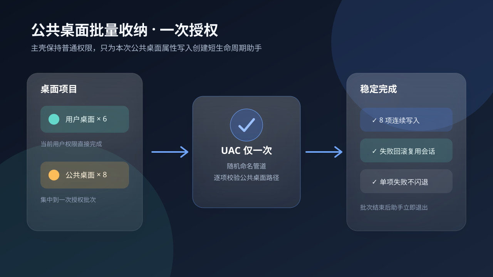

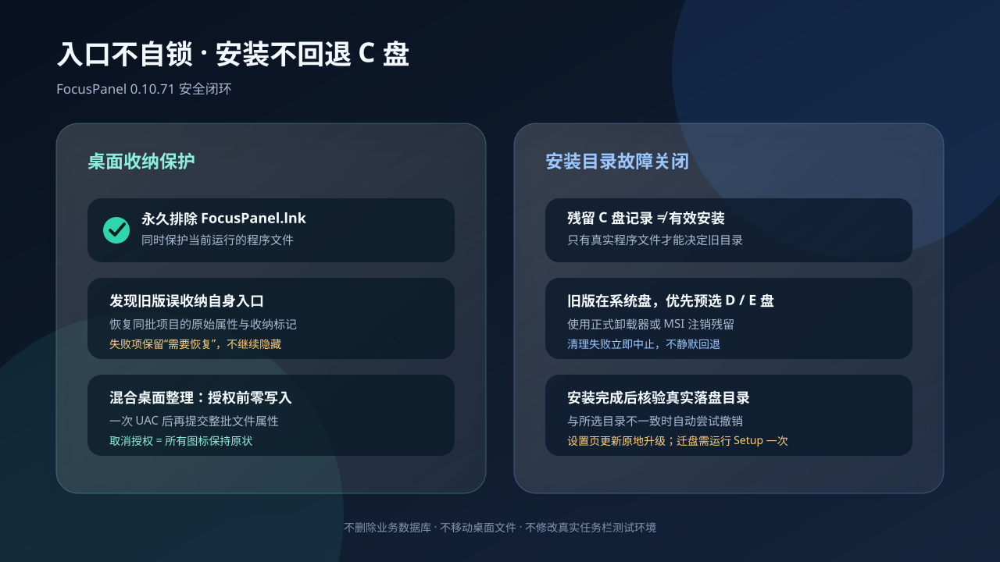

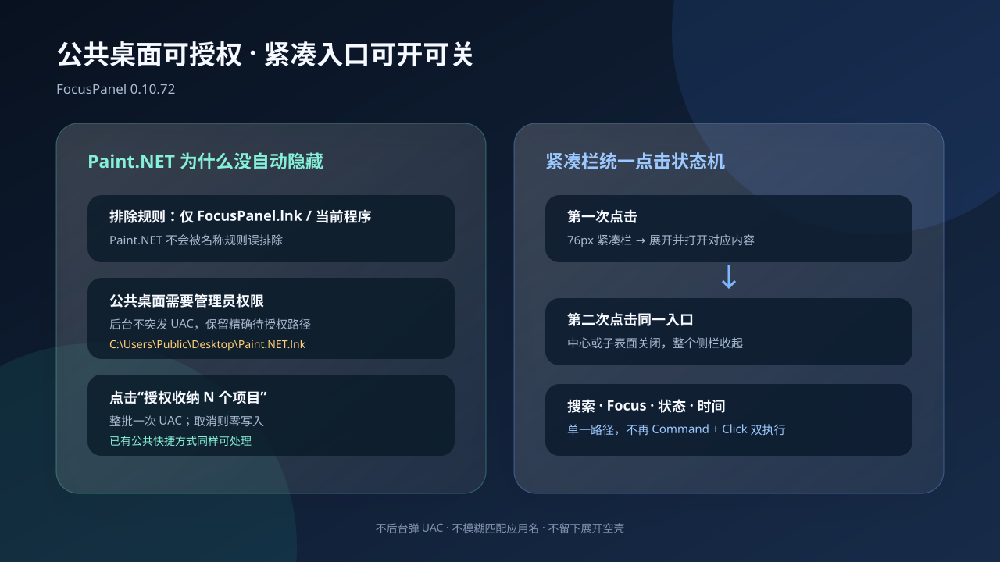

安装版和 Velopack 便携版统一使用项目的公开 [GitHub Releases](https://github.com/SakalioLabs/FocusPanel/releases)，无需在每台设备配置更新地址或访问令牌。客户端直接读取 GitHub Latest Release 的静态 `releases.win.json` 和包资产，不调用匿名 Releases API，因此不会因共享 IP 的 API 次数耗尽而收到 403。程序启动后会自动检查一次，之后每 6 小时最多检查一次；发现新版本时更新设置和托盘都会提示，但不会强制重启。

正式发布流程会把当前版本显式设为 GitHub Latest，并回读验证 `releases.win.json`、`RELEASES`、完整更新包、带路径向导的 Setup 和 MSI。Setup 在打包时以特殊探针参数无安装执行，必须返回目录向导专用标识；上传后还会将 GitHub 公开资产的 SHA-256 与本地文件比较，不能再由同名默认安装器悄悄顶替。中文发布说明使用带签名的 Unicode 中间文件，并在打包后与更新清单逐字核对；任何代码页转换或内容损坏都会直接中止发布。验证通过后，另一台设备只要安装过一次，以后即可在设置页直接完成检查、下载、安装和重启。个人设备使用 `Setup.exe` 选择目录，企业部署使用 MSI。设置页同时保留“打开官方下载页”按钮；网络策略、代理或临时服务异常时可以直接下载安装器覆盖升级，业务数据库和 `%APPDATA%` 设置不会被安装包删除。


用户点击“一键检查并安装更新”后，FocusPanel 会显示更新说明、下载完整包或差分包、备份数据库、恢复原任务栏设置，然后重启安装。其他设备首次运行 `Setup.exe` 时即可选择目录；后续版本均沿用同一条更新链，不会因自定义目录而回到默认位置。

设置页的一键更新是原地升级，不会主动搬迁已经安装在 C 盘的程序。需要释放 C 盘时，请先运行一次 0.10.71 或更高版本的 `FocusPanel-win-Setup.exe`，在路径窗口确认 D/E 盘；迁移完成后，后续一键更新会继续沿用该目录。


源码直接运行的开发版不会原地覆盖自身，设置页会提示先安装 `Setup.exe`。

## 多显示器右缘定位

0.10.21 起，Panel、12px 物理热区和 3px 运行指示条默认共同选择虚拟桌面中最外侧的右屏，而不是盲目使用主屏右缘。这样当主屏在左、副屏在右时，呼出位置位于整套显示器的最右边，不再卡在两屏接缝；副屏在左时则仍落在主屏外侧。0.10.27 进一步在移动窗口前直接读取目标显示器的有效 DPI，不再用窗口原来所在屏幕的 DPI 做第一次定位；收到 `WM_DPICHANGED` 后会按同一目标重新锚定。0.10.31 除了“自动：最右侧屏幕 / Windows 主屏”，还会列出每台已连接显示器的主屏标记、分辨率与虚拟桌面坐标，可以精确固定到上下排列、负坐标或三屏中的任意一台。目标设备断开时临时回退主屏但保留选择；目标切换、设备重连、分辨率、主屏或缩放改变时，Panel、热区和指示条都会一起重算。


将生成的包上传为 GitHub Release 草稿：

```powershell
$env:GITHUB_TOKEN = "仅放在当前终端，不要写入仓库"
.\scripts\publish-github-release.ps1 `
  -Version 0.9.64 `
  -Dotnet8Path dotnet
```

确认后添加 `-Publish` 可正式发布。推送 `v*` 标签或手动运行“构建并发布 Windows 安装包”工作流，也会自动构建、测试、生成差分包并创建 Release。

当前仓库没有提供代码签名证书，因此本地生成的安装包会显示“未知发布者”。正式分发时应通过 `-SignParams` 传入 `signtool.exe` 参数，或在发布工作流中接入 Azure Trusted Signing；不要把证书密码写入仓库。
