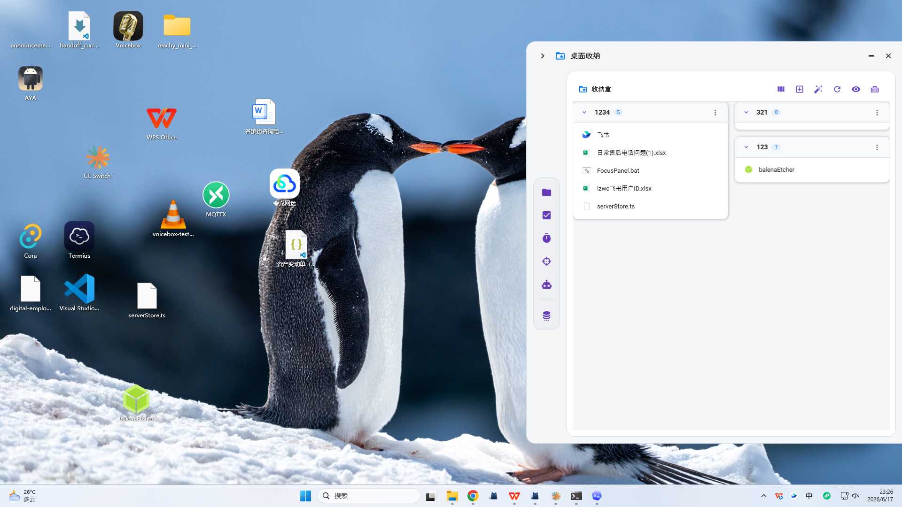

# FocusPanel

> 一个贴在桌面右侧的 WPF 效率面板：桌面图标收纳、任务管理、番茄钟、OKR 和 AI 助手都放在一个轻量侧边栏里。



## 亮点

- **桌面图标收纳**：文件仍然保留在桌面文件夹里，但桌面视觉上可以被收纳进面板分区。
- **右侧桌面抽屉**：只在桌面场景显示，切到其他应用时自动隐藏，尽量不遮挡工作流。
- **自由桌面布局**：桌面覆盖层支持图标拖拽放置、排序、右键菜单和图标尺寸调整。
- **分区式文件管理**：按自定义收纳盒、时间线、网格/列表视图整理桌面文件。
- **一体化效率工具**：内置任务、番茄钟、OKR、AI 助手和数据库备份恢复入口。

## 截图

### 桌面收纳面板

右侧抽屉贴边展开，收纳盒以卡片形式展示桌面文件。


### 桌面全局视图

FocusPanel 会在桌面层显示自定义图标覆盖层，支持拖拽、排序、右键操作和收纳到面板。


### 任务管理

支持项目、子任务、看板/列表模式和自定义字段。


### 番茄钟

专注、短休息、长休息状态切换，并记录专注会话。


## 功能

### 桌面文件收纳

- 扫描桌面文件并按收纳盒分区展示。
- 支持把桌面图标拖入面板，也支持从面板拖回桌面。
- 支持自由拖拽放置桌面图标，并持久化图标位置。
- 支持桌面右键菜单：打开、打开方式、复制、剪切、粘贴、重命名、删除、属性、排序等。
- 支持桌面图标大小调整：小、中、大、超大。
- 支持按名称、类型、时间、大小排序。
- 支持网格/列表双视图和自定义收纳盒。
- 支持 Rescue / Smart Grouping 修复和智能整理工具。

### 任务管理

- 多项目任务管理，项目下可包含子任务。
- 列表和看板视图。
- 自定义字段：文本、日期、下拉等。
- Inbox 根项目自动创建并保护。

### 番茄钟

- 工作、短休息、长休息状态切换。
- 专注时长统计与历史记录。
- 适合放在桌面侧栏里随时查看。

### OKR

- 管理 Objective 和 Key Result。
- 支持飞书 OKR API 双向同步。
- 跟踪同步状态：`Synced`、`LocalCreated`、`LocalModified`、`LocalDeleted`。

### AI 助手

- 提供聊天式 AI 入口。
- 为任务、文件、OKR 等数据接入预留接口。

## 技术栈

| 模块 | 技术 |
| --- | --- |
| 框架 | C# / .NET 7 / WPF |
| 架构 | MVVM / CommunityToolkit.Mvvm |
| UI | MaterialDesignInXamlToolkit |
| 数据库 | SQLite / EF Core 7 |
| 托盘 | Hardcodet.NotifyIcon.Wpf |
| 系统集成 | Win32 / DWM / Shell 图标 / 桌面窗口层 |

## 项目结构

```text
FocusPanel/
├─ Views/        # WPF 窗口和用户控件
├─ ViewModels/   # MVVM ViewModel
├─ Models/       # EF Core 实体和 DTO
├─ Services/     # 文件收纳、任务、OKR 同步等业务逻辑
├─ Data/         # AppDbContext 和 EnsureSchema 手动迁移
├─ Helpers/      # DesktopHelper、IconHelper 等 Win32 互操作
├─ Converters/   # WPF IValueConverter
└─ images/       # README 截图资源
```

## 构建与运行

```bash
dotnet build FocusPanel.csproj
dotnet run --project FocusPanel.csproj
```

要求：

- Windows 10/11
- .NET 7 SDK
- 本仓库没有 `.sln` 文件，直接打开或构建 `FocusPanel.csproj`

## 面板行为

- 面板固定在屏幕右侧：折叠宽度 `80px`，展开宽度 `800px`。
- 鼠标进入侧栏时展开，离开时折叠。
- 在桌面场景下显示，在普通应用前台时隐藏。
- 关闭窗口时默认隐藏到系统托盘，真正退出由 `ForceClose()` 触发。
- 数据库位置：`%APPDATA%/FocusPanel/focuspanel.db`。

## 数据与恢复

- 启动时自动检查数据库并执行 `EnsureSchema()`。
- 数据库损坏时会尝试归档损坏文件、恢复最新备份或重新创建。
- `DatabaseBackupService` 保留滚动备份。
- 支持 `--restore` 参数从最新备份恢复。
